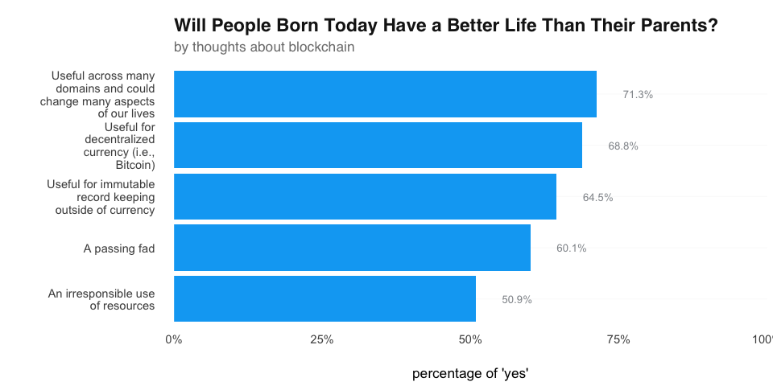
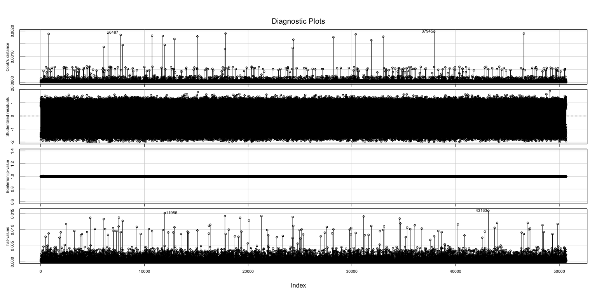

# Logistic Regression: will people born today will have a better life than their parents?
*course: Data Analysis in Sociology*  
*author: Ekaterina Skriptsova*  
*date: 2020-02-15*  

***

# introduction

> Do developers think that people born today will have a better life than their parents? 

Well, this work examines exactly this question using **Stack Overflow Developer Survey 2019**, which covers various aspects of developers' life. In this report, I focus on 6 variables: `Age`, `Gender`, `Region`, `SocialMedia`, `BlockchainIs`, and `BetterLife` -- the outcome. 

### why those? 

`Age` and `Gender` may seem as obvious ones, as representatives of different genders and generations sometimes have different attitudes to life. 

`Social media` may be used to develop a sense of belonging and connectedness, which can improve wellbeing and perhaps make people more optimistic about the future of children. I expected that the belief in happy future will differ depending on the social media that is used the most due to different "nature" of the services — some of them are just messengers allowing people to chat with friends, some also give an opportunity to read news, while social networking sites do all of that — show news, happy friends, some with perfect lives. Some also are the so-called superapps, e.g. WeChat, that include a whole set of different features in one application. Unfortunately, in this dataset we do not know the original reason of why and for what people use the social media (news, chat, etc.), so let's just see whether it differs. In sum, the news feeds here are different, and maybe sometimes the less you know — the better?

`Region` -- originally created from the `Country` variable, was added because both countries and regions do differ economically. 

`BlockchainIs` was the last variable added to the analysis, suggested by my colleague A. Nikulin. This is a developing technology, which probably may inspire the developers and make them believe in a brighter future. New tech - better life?


> Does the belief about better life of youth differ depending on the selected predictors?


### variables

The **outcome** variable is `BetterLife`: "Will People Born Today Have a Better Life Than Their Parents?". 

As for the predictors, the possible ones are:

- `Region` (constructed from `Country`)   
- `Gender`  
- `SocialMedia` 
- `BlockchainIs`  
- `Age`

**Final** equation in general form: 
$$log(\frac{p(BetterLife\_Yes)}{p(1 - BetterLife\_Yes)}) = \beta_0 + \beta_1*Region + \beta_2*BlockchainIs + \beta_3*Gender + \beta_4*Age$$
   

```r
df = res %>% dplyr::select(Country, SocialMedia, Gender, Age, BlockchainIs, BetterLife)
df = remove_attributes(df, "spec") 
df = df %>% dplyr::filter(!is.na(BetterLife))
factor_vars = c("Country", "SocialMedia", "Gender", "BlockchainIs",
                "BetterLife")
df[factor_vars] = data.frame(lapply(df[factor_vars], to_factor))
df$Region = countrycode::countrycode(df$Country, origin = "country.name", destination =  "region")
```

***

# **exploratory data analysis**

In this section, **exploratory data analysis** is performed in order to see how the selected variables are distributed, which should be further put into the model and may be important overall. Firstly, I make sure that variables of interest do not have too much missing data, and as a result - drop several ideas due to this fact. Then proceed with plotting the variables to check within which ones the percentage of those who believe that life for children will be better differs.


## missing data

At the data loading stage, I've deleted observations that did not have label for the outcome variable (`BetterLife`). Now let's see whether other variables have missing values, and if their amount is > 15% - try to remove them. Otherwise - think what can be done about that.   

As you can see from the following plot, `BlockchainIs` has ~30% of missings (similar to other predictors in full dataset), but without this one the models will be worse and less interesting, so I'll keep it. Uh. 

Another possible predictor that has many missing values is `Age`. This variable plays an important role in deciding whether people born today will have a better life than parents, according to publications on the Internet [1]. In total, approximately 10% of 86269 values are missing here. Thus, let's keep the variable but drop guys with unknown age. 

<!-- -->


## predictors

After removal of missing values in the previously mentioned variables, the dataset contains **50 841 observations**. 
Now the data has the following variables, which were used to create several models:

<table class="table table-striped table-hover table-condensed table-responsive" style="margin-left: auto; margin-right: auto;">
 <thead>
  <tr>
   <th style="text-align:left;"> feature </th>
   <th style="text-align:left;"> description </th>
  </tr>
 </thead>
<tbody>
  <tr>
   <td style="text-align:left;"> <span style="     color: #410093 !important;">BetterLife</span> </td>
   <td style="text-align:left;"> Do you think people born today will have a better life than their parents? </td>
  </tr>
  <tr>
   <td style="text-align:left;"> <span style="     color: #34465d !important;">Gender</span> </td>
   <td style="text-align:left;"> Which of the following do you currently identify as? </td>
  </tr>
  <tr>
   <td style="text-align:left;"> <span style="     color: #34465d !important;">Age</span> </td>
   <td style="text-align:left;"> What is your age (in years)? </td>
  </tr>
  <tr>
   <td style="text-align:left;"> <span style="     color: #34465d !important;">SocialMedia</span> </td>
   <td style="text-align:left;"> What social media site do you use the most? </td>
  </tr>
  <tr>
   <td style="text-align:left;"> <span style="     color: #34465d !important;">Region</span> </td>
   <td style="text-align:left;"> In which region (orig. - country) do you currently reside? </td>
  </tr>
  <tr>
   <td style="text-align:left;"> <span style="     color: #34465d !important;">BlockchainIs</span> </td>
   <td style="text-align:left;"> Blockchain / cryptocurrency technology is primarily: </td>
  </tr>
</tbody>
</table>


And basic descriptive statistics:


```
## The data contains 50841 observations of the following variables:
##   - SocialMedia: 14 levels: Facebook (n = 7402); Hello (n = 4); I don't use social media (n = 3099); Instagram (n = 3627); LinkedIn (n = 2456); Reddit (n = 10283); Snapchat (n = 416); Twitter (n = 7657); VK ВКонта́кте (n = 326); WeChat 微信 (n = 337); Weibo 新浪微博 (n = 32); WhatsApp (n = 7533); Youku Tudou 优酷 (n = 5) and YouTube (n = 7664)
##   - Gender: 7 levels: Man (n = 47179); Man;Non-binary, genderqueer, or gender non-conforming (n = 117); Non-binary, genderqueer, or gender non-conforming (n = 330); Woman (n = 3055); Woman;Man (n = 42); Woman;Man;Non-binary, genderqueer, or gender non-conforming (n = 27) and Woman;Non-binary, genderqueer, or gender non-conforming (n = 91)
##   - Age: Mean = 30.43, SD = 8.92, range = [1, 99], 0 missing
##   - BlockchainIs: 5 levels: A passing fad (n = 8596); An irresponsible use of resources (n = 7822); Useful across many domains and could change many aspects of our lives (n = 14805); Useful for decentralized currency (i.e., Bitcoin) (n = 6086) and Useful for immutable record keeping outside of currency (n = 13532)
##   - BetterLife: 2 levels: No (n = 18205) and Yes (n = 32636)
##   - Region: 20 entries: Northern America, n = 15330; Western Europe, n = 7697; Northern Europe, n = 6314 and 17 others
```

Let's proceed & see how these are distributed.

### outcome

As stated in the task, the **target** variable is `BetterLife` -  "Will People Born Today Have a Better Life Than Their Parents?". The users are quite optimistic about that: **64%** think that life will improve.   
Maybe they are working on new innovative technologies that will make the world a better place? Who knows! 😎

<!-- -->


### gender

In the full dataset, there are 7 unique options for `Gender`, however, in the Stack Overflow report they are split into: 

(1) Man,  
(2) Woman,  
(3) Non-binary, genderqueer, or gender non-conforming.   

Seems reasonable to join the levels into these three. The **majority** of respondents are **male** - approximately 93%; females constitute 6%, and non-binary, genderqueer, or gender non-conforming - 1%. 

```
##                                                              BetterLife
## Gender                                                           No   Yes
##   Man                                                         16504 30675
##   Man;Non-binary, genderqueer, or gender non-conforming          52    65
##   Non-binary, genderqueer, or gender non-conforming             169   161
##   Woman                                                        1406  1649
##   Woman;Man                                                       7    35
##   Woman;Man;Non-binary, genderqueer, or gender non-conforming    12    15
##   Woman;Non-binary, genderqueer, or gender non-conforming        55    36
```


The following figure shows that the **highest** percentage of those thinking that life will be better is among **males** (65%), followed by females (54%) which is 11% less compared to representatives of the opposite gender. The latter - Non-binary, genderqueer, or gender non-conforming (51.4%).

<!-- -->

### age

As mentioned in the introduction, people of different age groups have different opinion towards the life improvement. Does the relationship differ in Stack Overflow data?

First of all, `Age` variable contains several outliers: some respondents are just 1 year old & are already coding - definitely a mistake. Better to drop these guys and leave the developers aged from 14 to 80. Now there are **50 699** observations.


```
##    vars     n  mean   sd median trimmed  mad min max range skew kurtosis   se
## X1    1 50841 30.43 8.92     29   29.52 7.41   1  99    98 1.19     2.57 0.04
```


<!-- -->


### region

`Caribbean`,`Central Asia`,`Middle Africa` and `Western Africa` have relatively small number of observations in several cells.  
Based on the map & Google, I united `Middle Africa` with `Western Africa`, and `Central Asia` - with `Western Asia` because sometimes it is represented as "Western & Central Asia". `Melanesia` was also united with `Australia and New Zealand`. `Caribbean` were left as is because it differs from the nearby regions and is located somewhere between. 


```
##                                        BetterLife
## Region                                    No  Yes
##   Caribbean                               20   80
##   Central America                        158  398
##   Eastern Africa                          63  233
##   Eastern Asia                           220  632
##   Eastern Europe                        1033 3070
##   Melanesia & Australia and New Zealand  562 1002
##   Middle & Western Africa                 63  293
##   Northern Africa                         72  219
##   Northern America                      5865 9406
##   Northern Europe                       2477 3818
##   South America                          522 1569
##   South-Eastern Asia                     199  733
##   Southern Africa                        151  275
##   Southern Asia                         1533 3755
##   Southern Europe                       1200 1955
##   Western & Central Asia                 471  965
##   Western Europe                        3558 4129
```


The **most optimistic** people are in Middle & Western Africa (**82%**), Caribbean (80%), Eastern Africa (78.7%) and South-Eastern Asia (78.5%). The **least** - among the developers in Southern (62%), Northern (61.6%) and Western Europe (53.7%). Wow. In comparison, 74.8% of those in Eastern Europe, including Russia, believe that youth will have a better life than their parents. Developers in **Northern America** (e.g. USA) are also not sure that life will improve: only **61.6%** of them agreed.


<!-- -->


### social media

`SocialMedia` shows the respondent's most frequently used social media. The most popular here are: Facebook, WhatsApp, Twitter, Reddit, YouTube; 3082 users do not use social media at all.   

Overall, `Facebook` & `VK` are **social networking sites**, that have both quite rich newsfeeds and communication tools. `LinkedIn` - job-related stuff. `Reddit`, `Snapchat`, `Instagram`, `Youtube` & `Youku Tudou` can be grouped into **entertainment services**, however, some of them also may act as a place for discussions (1st one), and the format slightly differs - the latter two are video-hosting services. `WhatsApp` - a **messenger** owned by Facebook; `WeChat` is a Chinese **super-app**, which includes a lot of features from messaging, social media to mobile payment app. `Twitter` - mostly about **microblogging** (and posting sad stuff), `Weibo` - also microblogging website but popular in China.

`Hello` is also a real social network, however, only 4 people frequently use it. Maybe they are the developers of this site? Spoiler: this level was not significant, but should we keep it or drop it? Joining it with Weibo and Youku Tudou did not make much difference, so it's better to delete these several observations.


```
##                           BetterLife
## SocialMedia                  No  Yes
##   Facebook                 2533 4862
##   Hello                       0    4
##   I don't use social media 1457 1625
##   Instagram                1249 2365
##   LinkedIn                  896 1558
##   Reddit                   3580 6682
##   Snapchat                  125  288
##   Twitter                  3080 4571
##   VK ВКонта́кте               56  268
##   WeChat 微信                71  263
##   Weibo 新浪微博              6   26
##   WhatsApp                 2714 4813
##   Youku Tudou 优酷            1    3
##   YouTube                  2399 5204
```


The **highest** percentage of those thinking that people born today will have a better life than their parents is among users of **VK** 💙 - **82.7%** selected "Yes", which is quite understandable given that most of them come from Eastern Europe (e.g. Russia), where situation was not the best one and now has improved. This is followed by the users of **WeChat**: **78.7%** of them are sure. This application is widely popular in China, so this result may be related to the country's growth [2]. 

Those who frequently use worldwide SNs and **entertainment services**, such as Snapchat, YouTube, Instagram, Facebook and Reddit - have from **69 to 63%** of believers in better life. In particular, for **FB** users figure is **65.75%**, which is by ~17% lower compared to VK. Perhaps, this is due to Facebook being used by people all around the world, and the attitude may differ depending on the country. 

**Twitter**, as I expected, has **one of the lowest** percentages - only **59.74%** of those who use it frequently  have optimistic thoughts about the future. And approximately half of those who **do not use social media** have a similar attitude - **52.73%**. I suppose that this may happen due to several reasons: maybe some users do not browse social media because they are disappointed with what they saw at some point, or just think that social media makes life sadder, or social media may make someone feel rather isolated and not more connected, etc.

<!-- -->


In sum, those who frequently use worldwide entertainment services, e.g. Youtube or Snapchat, have higher percantage of those thinking that youth will live better than their parents, while those who use Twitter (news + tweets about life) and LinkedIn (job-related) - are least optimistic about the future, followed by those who do not use social media at all.


### blockchainIs ⭐

And a bonus/additional variable suggested in a chat with A. Nikulin: `BlockchainIs` (Blockchain / cryptocurrency technology is primarily:..).

One may think how can this one be related to the `BetterLife`? Well, turned out that `BlockchainIs` is connected to the outcome. The variable has 5 levels: 

- A passing fad (n = 8569);   
- An irresponsible use of resources (n = 7794);   
- Useful across many domains and could change many aspects of our lives (n = 14751);   
- Useful for decentralized currency (i.e., Bitcoin) (n = 6035);   
- Useful for immutable record keeping outside of currency (n = 13510)  

Developers who consider blockchain as **useful** in some way are positively thinking about the youth having a better life - from **71.3%** to **64.5%**! Those who have rather negative attitude (a passing fad or an irresponsible use of resources) have lower value.

```
## The data contains 50659 observations of the following variables:
##   - SocialMedia: 11 levels: Facebook (n = 7395); I don't use social media (n = 3082); Instagram (n = 3614); LinkedIn (n = 2454); Reddit (n = 10262); Snapchat (n = 413); Twitter (n = 7651); VK ВКонта́кте (n = 324); WeChat 微信 (n = 334); WhatsApp (n = 7527) and YouTube (n = 7603)
##   - Gender: 3 levels: Man (n = 47019); Non-binary, genderqueer, or gender non-conforming (n = 600) and Woman (n = 3040)
##   - Age: Mean = 30.46, SD = 8.81, range = [14, 79], 0 missing
##   - BlockchainIs: 5 levels: A passing fad (n = 8569); An irresponsible use of resources (n = 7794); Useful across many domains and could change many aspects of our lives (n = 14751); Useful for decentralized currency (i.e., Bitcoin) (n = 6035) and Useful for immutable record keeping outside of currency (n = 13510)
##   - BetterLife: 2 levels: No (n = 18160) and Yes (n = 32499)
##   - Region: 17 levels: Northern America (n = 15266); Caribbean (n = 100); Central America (n = 556); Eastern Africa (n = 296); Eastern Asia (n = 823); Eastern Europe (n = 4103); Melanesia & Australia and New Zealand (n = 1563); Middle & Western Africa (n = 355); Northern Africa (n = 291); Northern Europe (n = 6294); South America (n = 2091); South-Eastern Asia (n = 929); Southern Africa (n = 426); Southern Asia (n = 5288); Southern Europe (n = 3155); Western & Central Asia (n = 1436) and Western Europe (n = 7687)
```


<!-- -->


***


# logistic regression


## models


```r
logit_sm = readRDS("logit_sm.rds")
logit_age = readRDS("logit_age.rds")
logit_reg = readRDS("logit_reg.rds")
logit_block = readRDS("logit_block.rds")
```


### single predictor

The first models contain only one predictor. Among the presented, the best one, according to the R2 Tjur, AIC, and log-Likelihood is the one with `Region`, where the reference level is Northern America. Second-best - `BlockchainIs`. Let's proceed with more complex models and see what happens.

<table style="border-collapse:collapse; border:none;">
<caption style="font-weight: bold; text-align:left;">Models with single predictors</caption>
<tr>
<th style="border-top: double; text-align:center; font-style:normal; font-weight:bold; padding:0.2cm;  text-align:left; ">&nbsp;</th>
<th colspan="4" style="border-top: double; text-align:center; font-style:normal; font-weight:bold; padding:0.2cm; ">BetterLife</th>
<th colspan="4" style="border-top: double; text-align:center; font-style:normal; font-weight:bold; padding:0.2cm; ">BetterLife</th>
<th colspan="4" style="border-top: double; text-align:center; font-style:normal; font-weight:bold; padding:0.2cm; ">BetterLife</th>
</tr>
<tr>
<td style=" text-align:center; border-bottom:1px solid; font-style:italic; font-weight:normal;  text-align:left; ">Predictors</td>
<td style=" text-align:center; border-bottom:1px solid; font-style:italic; font-weight:normal;  ">Odds Ratios</td>
<td style=" text-align:center; border-bottom:1px solid; font-style:italic; font-weight:normal;  ">std. Error</td>
<td style=" text-align:center; border-bottom:1px solid; font-style:italic; font-weight:normal;  ">CI</td>
<td style=" text-align:center; border-bottom:1px solid; font-style:italic; font-weight:normal;  ">p</td>
<td style=" text-align:center; border-bottom:1px solid; font-style:italic; font-weight:normal;  ">Odds Ratios</td>
<td style=" text-align:center; border-bottom:1px solid; font-style:italic; font-weight:normal;  col7">std. Error</td>
<td style=" text-align:center; border-bottom:1px solid; font-style:italic; font-weight:normal;  col8">CI</td>
<td style=" text-align:center; border-bottom:1px solid; font-style:italic; font-weight:normal;  col9">p</td>
<td style=" text-align:center; border-bottom:1px solid; font-style:italic; font-weight:normal;  0">Odds Ratios</td>
<td style=" text-align:center; border-bottom:1px solid; font-style:italic; font-weight:normal;  1">std. Error</td>
<td style=" text-align:center; border-bottom:1px solid; font-style:italic; font-weight:normal;  2">CI</td>
<td style=" text-align:center; border-bottom:1px solid; font-style:italic; font-weight:normal;  3">p</td>
</tr>
<tr>
<td style=" padding:0.2cm; text-align:left; vertical-align:top; text-align:left; ">(Intercept)</td>
<td style=" padding:0.2cm; text-align:left; vertical-align:top; text-align:center;  ">1.92</td>
<td style=" padding:0.2cm; text-align:left; vertical-align:top; text-align:center;  ">0.02</td>
<td style=" padding:0.2cm; text-align:left; vertical-align:top; text-align:center;  ">1.83&nbsp;&ndash;&nbsp;2.01</td>
<td style=" padding:0.2cm; text-align:left; vertical-align:top; text-align:center;  "><strong>&lt;0.001</td>
<td style=" padding:0.2cm; text-align:left; vertical-align:top; text-align:center;  ">1.60</td>
<td style=" padding:0.2cm; text-align:left; vertical-align:top; text-align:center;  col7">0.02</td>
<td style=" padding:0.2cm; text-align:left; vertical-align:top; text-align:center;  col8">1.55&nbsp;&ndash;&nbsp;1.66</td>
<td style=" padding:0.2cm; text-align:left; vertical-align:top; text-align:center;  col9"><strong>&lt;0.001</td>
<td style=" padding:0.2cm; text-align:left; vertical-align:top; text-align:center;  0">1.51</td>
<td style=" padding:0.2cm; text-align:left; vertical-align:top; text-align:center;  1">0.02</td>
<td style=" padding:0.2cm; text-align:left; vertical-align:top; text-align:center;  2">1.44&nbsp;&ndash;&nbsp;1.57</td>
<td style=" padding:0.2cm; text-align:left; vertical-align:top; text-align:center;  3"><strong>&lt;0.001</td>
</tr>
<tr>
<td style=" padding:0.2cm; text-align:left; vertical-align:top; text-align:left; ">Facebook</td>
<td style=" padding:0.2cm; text-align:left; vertical-align:top; text-align:center;  "><em>Reference</em></td>
<td style=" padding:0.2cm; text-align:left; vertical-align:top; text-align:center;  "></td>
<td style=" padding:0.2cm; text-align:left; vertical-align:top; text-align:center;  "></td>
<td style=" padding:0.2cm; text-align:left; vertical-align:top; text-align:center;  "></td>
<td style=" padding:0.2cm; text-align:left; vertical-align:top; text-align:center;  "><em>Reference</em></td>
<td style=" padding:0.2cm; text-align:left; vertical-align:top; text-align:center;  col7"></td>
<td style=" padding:0.2cm; text-align:left; vertical-align:top; text-align:center;  col8"></td>
<td style=" padding:0.2cm; text-align:left; vertical-align:top; text-align:center;  col9"></td>
<td style=" padding:0.2cm; text-align:left; vertical-align:top; text-align:center;  0"><em>Reference</em></td>
<td style=" padding:0.2cm; text-align:left; vertical-align:top; text-align:center;  1"></td>
<td style=" padding:0.2cm; text-align:left; vertical-align:top; text-align:center;  2"></td>
<td style=" padding:0.2cm; text-align:left; vertical-align:top; text-align:center;  3"></td>
</tr>
<tr>
<td style=" padding:0.2cm; text-align:left; vertical-align:top; text-align:left; ">I don't use social media</td>
<td style=" padding:0.2cm; text-align:left; vertical-align:top; text-align:center;  ">0.58</td>
<td style=" padding:0.2cm; text-align:left; vertical-align:top; text-align:center;  ">0.04</td>
<td style=" padding:0.2cm; text-align:left; vertical-align:top; text-align:center;  ">0.53&nbsp;&ndash;&nbsp;0.63</td>
<td style=" padding:0.2cm; text-align:left; vertical-align:top; text-align:center;  "><strong>&lt;0.001</td>
<td style=" padding:0.2cm; text-align:left; vertical-align:top; text-align:center;  "></td>
<td style=" padding:0.2cm; text-align:left; vertical-align:top; text-align:center;  col7"></td>
<td style=" padding:0.2cm; text-align:left; vertical-align:top; text-align:center;  col8"></td>
<td style=" padding:0.2cm; text-align:left; vertical-align:top; text-align:center;  col9"></td>
<td style=" padding:0.2cm; text-align:left; vertical-align:top; text-align:center;  0"></td>
<td style=" padding:0.2cm; text-align:left; vertical-align:top; text-align:center;  1"></td>
<td style=" padding:0.2cm; text-align:left; vertical-align:top; text-align:center;  2"></td>
<td style=" padding:0.2cm; text-align:left; vertical-align:top; text-align:center;  3"></td>
</tr>
<tr>
<td style=" padding:0.2cm; text-align:left; vertical-align:top; text-align:left; ">Instagram</td>
<td style=" padding:0.2cm; text-align:left; vertical-align:top; text-align:center;  ">0.99</td>
<td style=" padding:0.2cm; text-align:left; vertical-align:top; text-align:center;  ">0.04</td>
<td style=" padding:0.2cm; text-align:left; vertical-align:top; text-align:center;  ">0.91&nbsp;&ndash;&nbsp;1.07</td>
<td style=" padding:0.2cm; text-align:left; vertical-align:top; text-align:center;  ">0.750</td>
<td style=" padding:0.2cm; text-align:left; vertical-align:top; text-align:center;  "></td>
<td style=" padding:0.2cm; text-align:left; vertical-align:top; text-align:center;  col7"></td>
<td style=" padding:0.2cm; text-align:left; vertical-align:top; text-align:center;  col8"></td>
<td style=" padding:0.2cm; text-align:left; vertical-align:top; text-align:center;  col9"></td>
<td style=" padding:0.2cm; text-align:left; vertical-align:top; text-align:center;  0"></td>
<td style=" padding:0.2cm; text-align:left; vertical-align:top; text-align:center;  1"></td>
<td style=" padding:0.2cm; text-align:left; vertical-align:top; text-align:center;  2"></td>
<td style=" padding:0.2cm; text-align:left; vertical-align:top; text-align:center;  3"></td>
</tr>
<tr>
<td style=" padding:0.2cm; text-align:left; vertical-align:top; text-align:left; ">LinkedIn</td>
<td style=" padding:0.2cm; text-align:left; vertical-align:top; text-align:center;  ">0.91</td>
<td style=" padding:0.2cm; text-align:left; vertical-align:top; text-align:center;  ">0.05</td>
<td style=" padding:0.2cm; text-align:left; vertical-align:top; text-align:center;  ">0.82&nbsp;&ndash;&nbsp;1.00</td>
<td style=" padding:0.2cm; text-align:left; vertical-align:top; text-align:center;  "><strong>0.042</strong></td>
<td style=" padding:0.2cm; text-align:left; vertical-align:top; text-align:center;  "></td>
<td style=" padding:0.2cm; text-align:left; vertical-align:top; text-align:center;  col7"></td>
<td style=" padding:0.2cm; text-align:left; vertical-align:top; text-align:center;  col8"></td>
<td style=" padding:0.2cm; text-align:left; vertical-align:top; text-align:center;  col9"></td>
<td style=" padding:0.2cm; text-align:left; vertical-align:top; text-align:center;  0"></td>
<td style=" padding:0.2cm; text-align:left; vertical-align:top; text-align:center;  1"></td>
<td style=" padding:0.2cm; text-align:left; vertical-align:top; text-align:center;  2"></td>
<td style=" padding:0.2cm; text-align:left; vertical-align:top; text-align:center;  3"></td>
</tr>
<tr>
<td style=" padding:0.2cm; text-align:left; vertical-align:top; text-align:left; ">Reddit</td>
<td style=" padding:0.2cm; text-align:left; vertical-align:top; text-align:center;  ">0.97</td>
<td style=" padding:0.2cm; text-align:left; vertical-align:top; text-align:center;  ">0.03</td>
<td style=" padding:0.2cm; text-align:left; vertical-align:top; text-align:center;  ">0.91&nbsp;&ndash;&nbsp;1.04</td>
<td style=" padding:0.2cm; text-align:left; vertical-align:top; text-align:center;  ">0.383</td>
<td style=" padding:0.2cm; text-align:left; vertical-align:top; text-align:center;  "></td>
<td style=" padding:0.2cm; text-align:left; vertical-align:top; text-align:center;  col7"></td>
<td style=" padding:0.2cm; text-align:left; vertical-align:top; text-align:center;  col8"></td>
<td style=" padding:0.2cm; text-align:left; vertical-align:top; text-align:center;  col9"></td>
<td style=" padding:0.2cm; text-align:left; vertical-align:top; text-align:center;  0"></td>
<td style=" padding:0.2cm; text-align:left; vertical-align:top; text-align:center;  1"></td>
<td style=" padding:0.2cm; text-align:left; vertical-align:top; text-align:center;  2"></td>
<td style=" padding:0.2cm; text-align:left; vertical-align:top; text-align:center;  3"></td>
</tr>
<tr>
<td style=" padding:0.2cm; text-align:left; vertical-align:top; text-align:left; ">Snapchat</td>
<td style=" padding:0.2cm; text-align:left; vertical-align:top; text-align:center;  ">1.20</td>
<td style=" padding:0.2cm; text-align:left; vertical-align:top; text-align:center;  ">0.11</td>
<td style=" padding:0.2cm; text-align:left; vertical-align:top; text-align:center;  ">0.97&nbsp;&ndash;&nbsp;1.49</td>
<td style=" padding:0.2cm; text-align:left; vertical-align:top; text-align:center;  ">0.097</td>
<td style=" padding:0.2cm; text-align:left; vertical-align:top; text-align:center;  "></td>
<td style=" padding:0.2cm; text-align:left; vertical-align:top; text-align:center;  col7"></td>
<td style=" padding:0.2cm; text-align:left; vertical-align:top; text-align:center;  col8"></td>
<td style=" padding:0.2cm; text-align:left; vertical-align:top; text-align:center;  col9"></td>
<td style=" padding:0.2cm; text-align:left; vertical-align:top; text-align:center;  0"></td>
<td style=" padding:0.2cm; text-align:left; vertical-align:top; text-align:center;  1"></td>
<td style=" padding:0.2cm; text-align:left; vertical-align:top; text-align:center;  2"></td>
<td style=" padding:0.2cm; text-align:left; vertical-align:top; text-align:center;  3"></td>
</tr>
<tr>
<td style=" padding:0.2cm; text-align:left; vertical-align:top; text-align:left; ">Twitter</td>
<td style=" padding:0.2cm; text-align:left; vertical-align:top; text-align:center;  ">0.77</td>
<td style=" padding:0.2cm; text-align:left; vertical-align:top; text-align:center;  ">0.03</td>
<td style=" padding:0.2cm; text-align:left; vertical-align:top; text-align:center;  ">0.72&nbsp;&ndash;&nbsp;0.83</td>
<td style=" padding:0.2cm; text-align:left; vertical-align:top; text-align:center;  "><strong>&lt;0.001</td>
<td style=" padding:0.2cm; text-align:left; vertical-align:top; text-align:center;  "></td>
<td style=" padding:0.2cm; text-align:left; vertical-align:top; text-align:center;  col7"></td>
<td style=" padding:0.2cm; text-align:left; vertical-align:top; text-align:center;  col8"></td>
<td style=" padding:0.2cm; text-align:left; vertical-align:top; text-align:center;  col9"></td>
<td style=" padding:0.2cm; text-align:left; vertical-align:top; text-align:center;  0"></td>
<td style=" padding:0.2cm; text-align:left; vertical-align:top; text-align:center;  1"></td>
<td style=" padding:0.2cm; text-align:left; vertical-align:top; text-align:center;  2"></td>
<td style=" padding:0.2cm; text-align:left; vertical-align:top; text-align:center;  3"></td>
</tr>
<tr>
<td style=" padding:0.2cm; text-align:left; vertical-align:top; text-align:left; ">VK ВКонта́кте</td>
<td style=" padding:0.2cm; text-align:left; vertical-align:top; text-align:center;  ">2.49</td>
<td style=" padding:0.2cm; text-align:left; vertical-align:top; text-align:center;  ">0.15</td>
<td style=" padding:0.2cm; text-align:left; vertical-align:top; text-align:center;  ">1.88&nbsp;&ndash;&nbsp;3.37</td>
<td style=" padding:0.2cm; text-align:left; vertical-align:top; text-align:center;  "><strong>&lt;0.001</td>
<td style=" padding:0.2cm; text-align:left; vertical-align:top; text-align:center;  "></td>
<td style=" padding:0.2cm; text-align:left; vertical-align:top; text-align:center;  col7"></td>
<td style=" padding:0.2cm; text-align:left; vertical-align:top; text-align:center;  col8"></td>
<td style=" padding:0.2cm; text-align:left; vertical-align:top; text-align:center;  col9"></td>
<td style=" padding:0.2cm; text-align:left; vertical-align:top; text-align:center;  0"></td>
<td style=" padding:0.2cm; text-align:left; vertical-align:top; text-align:center;  1"></td>
<td style=" padding:0.2cm; text-align:left; vertical-align:top; text-align:center;  2"></td>
<td style=" padding:0.2cm; text-align:left; vertical-align:top; text-align:center;  3"></td>
</tr>
<tr>
<td style=" padding:0.2cm; text-align:left; vertical-align:top; text-align:left; ">WeChat 微信</td>
<td style=" padding:0.2cm; text-align:left; vertical-align:top; text-align:center;  ">1.93</td>
<td style=" padding:0.2cm; text-align:left; vertical-align:top; text-align:center;  ">0.14</td>
<td style=" padding:0.2cm; text-align:left; vertical-align:top; text-align:center;  ">1.49&nbsp;&ndash;&nbsp;2.54</td>
<td style=" padding:0.2cm; text-align:left; vertical-align:top; text-align:center;  "><strong>&lt;0.001</td>
<td style=" padding:0.2cm; text-align:left; vertical-align:top; text-align:center;  "></td>
<td style=" padding:0.2cm; text-align:left; vertical-align:top; text-align:center;  col7"></td>
<td style=" padding:0.2cm; text-align:left; vertical-align:top; text-align:center;  col8"></td>
<td style=" padding:0.2cm; text-align:left; vertical-align:top; text-align:center;  col9"></td>
<td style=" padding:0.2cm; text-align:left; vertical-align:top; text-align:center;  0"></td>
<td style=" padding:0.2cm; text-align:left; vertical-align:top; text-align:center;  1"></td>
<td style=" padding:0.2cm; text-align:left; vertical-align:top; text-align:center;  2"></td>
<td style=" padding:0.2cm; text-align:left; vertical-align:top; text-align:center;  3"></td>
</tr>
<tr>
<td style=" padding:0.2cm; text-align:left; vertical-align:top; text-align:left; ">WhatsApp</td>
<td style=" padding:0.2cm; text-align:left; vertical-align:top; text-align:center;  ">0.92</td>
<td style=" padding:0.2cm; text-align:left; vertical-align:top; text-align:center;  ">0.03</td>
<td style=" padding:0.2cm; text-align:left; vertical-align:top; text-align:center;  ">0.86&nbsp;&ndash;&nbsp;0.99</td>
<td style=" padding:0.2cm; text-align:left; vertical-align:top; text-align:center;  "><strong>0.021</strong></td>
<td style=" padding:0.2cm; text-align:left; vertical-align:top; text-align:center;  "></td>
<td style=" padding:0.2cm; text-align:left; vertical-align:top; text-align:center;  col7"></td>
<td style=" padding:0.2cm; text-align:left; vertical-align:top; text-align:center;  col8"></td>
<td style=" padding:0.2cm; text-align:left; vertical-align:top; text-align:center;  col9"></td>
<td style=" padding:0.2cm; text-align:left; vertical-align:top; text-align:center;  0"></td>
<td style=" padding:0.2cm; text-align:left; vertical-align:top; text-align:center;  1"></td>
<td style=" padding:0.2cm; text-align:left; vertical-align:top; text-align:center;  2"></td>
<td style=" padding:0.2cm; text-align:left; vertical-align:top; text-align:center;  3"></td>
</tr>
<tr>
<td style=" padding:0.2cm; text-align:left; vertical-align:top; text-align:left; ">YouTube</td>
<td style=" padding:0.2cm; text-align:left; vertical-align:top; text-align:center;  ">1.13</td>
<td style=" padding:0.2cm; text-align:left; vertical-align:top; text-align:center;  ">0.03</td>
<td style=" padding:0.2cm; text-align:left; vertical-align:top; text-align:center;  ">1.06&nbsp;&ndash;&nbsp;1.21</td>
<td style=" padding:0.2cm; text-align:left; vertical-align:top; text-align:center;  "><strong>&lt;0.001</td>
<td style=" padding:0.2cm; text-align:left; vertical-align:top; text-align:center;  "></td>
<td style=" padding:0.2cm; text-align:left; vertical-align:top; text-align:center;  col7"></td>
<td style=" padding:0.2cm; text-align:left; vertical-align:top; text-align:center;  col8"></td>
<td style=" padding:0.2cm; text-align:left; vertical-align:top; text-align:center;  col9"></td>
<td style=" padding:0.2cm; text-align:left; vertical-align:top; text-align:center;  0"></td>
<td style=" padding:0.2cm; text-align:left; vertical-align:top; text-align:center;  1"></td>
<td style=" padding:0.2cm; text-align:left; vertical-align:top; text-align:center;  2"></td>
<td style=" padding:0.2cm; text-align:left; vertical-align:top; text-align:center;  3"></td>
</tr>
<tr>
<td style=" padding:0.2cm; text-align:left; vertical-align:top; text-align:left; ">Northern America</td>
<td style=" padding:0.2cm; text-align:left; vertical-align:top; text-align:center;  "><em>Reference</em></td>
<td style=" padding:0.2cm; text-align:left; vertical-align:top; text-align:center;  "></td>
<td style=" padding:0.2cm; text-align:left; vertical-align:top; text-align:center;  "></td>
<td style=" padding:0.2cm; text-align:left; vertical-align:top; text-align:center;  "></td>
<td style=" padding:0.2cm; text-align:left; vertical-align:top; text-align:center;  "><em>Reference</em></td>
<td style=" padding:0.2cm; text-align:left; vertical-align:top; text-align:center;  col7"></td>
<td style=" padding:0.2cm; text-align:left; vertical-align:top; text-align:center;  col8"></td>
<td style=" padding:0.2cm; text-align:left; vertical-align:top; text-align:center;  col9"></td>
<td style=" padding:0.2cm; text-align:left; vertical-align:top; text-align:center;  0"><em>Reference</em></td>
<td style=" padding:0.2cm; text-align:left; vertical-align:top; text-align:center;  1"></td>
<td style=" padding:0.2cm; text-align:left; vertical-align:top; text-align:center;  2"></td>
<td style=" padding:0.2cm; text-align:left; vertical-align:top; text-align:center;  3"></td>
</tr>
<tr>
<td style=" padding:0.2cm; text-align:left; vertical-align:top; text-align:left; ">Caribbean</td>
<td style=" padding:0.2cm; text-align:left; vertical-align:top; text-align:center;  "></td>
<td style=" padding:0.2cm; text-align:left; vertical-align:top; text-align:center;  "></td>
<td style=" padding:0.2cm; text-align:left; vertical-align:top; text-align:center;  "></td>
<td style=" padding:0.2cm; text-align:left; vertical-align:top; text-align:center;  "></td>
<td style=" padding:0.2cm; text-align:left; vertical-align:top; text-align:center;  ">2.50</td>
<td style=" padding:0.2cm; text-align:left; vertical-align:top; text-align:center;  col7">0.25</td>
<td style=" padding:0.2cm; text-align:left; vertical-align:top; text-align:center;  col8">1.56&nbsp;&ndash;&nbsp;4.19</td>
<td style=" padding:0.2cm; text-align:left; vertical-align:top; text-align:center;  col9"><strong>&lt;0.001</td>
<td style=" padding:0.2cm; text-align:left; vertical-align:top; text-align:center;  0"></td>
<td style=" padding:0.2cm; text-align:left; vertical-align:top; text-align:center;  1"></td>
<td style=" padding:0.2cm; text-align:left; vertical-align:top; text-align:center;  2"></td>
<td style=" padding:0.2cm; text-align:left; vertical-align:top; text-align:center;  3"></td>
</tr>
<tr>
<td style=" padding:0.2cm; text-align:left; vertical-align:top; text-align:left; ">Central America</td>
<td style=" padding:0.2cm; text-align:left; vertical-align:top; text-align:center;  "></td>
<td style=" padding:0.2cm; text-align:left; vertical-align:top; text-align:center;  "></td>
<td style=" padding:0.2cm; text-align:left; vertical-align:top; text-align:center;  "></td>
<td style=" padding:0.2cm; text-align:left; vertical-align:top; text-align:center;  "></td>
<td style=" padding:0.2cm; text-align:left; vertical-align:top; text-align:center;  ">1.57</td>
<td style=" padding:0.2cm; text-align:left; vertical-align:top; text-align:center;  col7">0.10</td>
<td style=" padding:0.2cm; text-align:left; vertical-align:top; text-align:center;  col8">1.31&nbsp;&ndash;&nbsp;1.90</td>
<td style=" padding:0.2cm; text-align:left; vertical-align:top; text-align:center;  col9"><strong>&lt;0.001</td>
<td style=" padding:0.2cm; text-align:left; vertical-align:top; text-align:center;  0"></td>
<td style=" padding:0.2cm; text-align:left; vertical-align:top; text-align:center;  1"></td>
<td style=" padding:0.2cm; text-align:left; vertical-align:top; text-align:center;  2"></td>
<td style=" padding:0.2cm; text-align:left; vertical-align:top; text-align:center;  3"></td>
</tr>
<tr>
<td style=" padding:0.2cm; text-align:left; vertical-align:top; text-align:left; ">Eastern Africa</td>
<td style=" padding:0.2cm; text-align:left; vertical-align:top; text-align:center;  "></td>
<td style=" padding:0.2cm; text-align:left; vertical-align:top; text-align:center;  "></td>
<td style=" padding:0.2cm; text-align:left; vertical-align:top; text-align:center;  "></td>
<td style=" padding:0.2cm; text-align:left; vertical-align:top; text-align:center;  "></td>
<td style=" padding:0.2cm; text-align:left; vertical-align:top; text-align:center;  ">2.31</td>
<td style=" padding:0.2cm; text-align:left; vertical-align:top; text-align:center;  col7">0.14</td>
<td style=" padding:0.2cm; text-align:left; vertical-align:top; text-align:center;  col8">1.76&nbsp;&ndash;&nbsp;3.08</td>
<td style=" padding:0.2cm; text-align:left; vertical-align:top; text-align:center;  col9"><strong>&lt;0.001</td>
<td style=" padding:0.2cm; text-align:left; vertical-align:top; text-align:center;  0"></td>
<td style=" padding:0.2cm; text-align:left; vertical-align:top; text-align:center;  1"></td>
<td style=" padding:0.2cm; text-align:left; vertical-align:top; text-align:center;  2"></td>
<td style=" padding:0.2cm; text-align:left; vertical-align:top; text-align:center;  3"></td>
</tr>
<tr>
<td style=" padding:0.2cm; text-align:left; vertical-align:top; text-align:left; ">Eastern Asia</td>
<td style=" padding:0.2cm; text-align:left; vertical-align:top; text-align:center;  "></td>
<td style=" padding:0.2cm; text-align:left; vertical-align:top; text-align:center;  "></td>
<td style=" padding:0.2cm; text-align:left; vertical-align:top; text-align:center;  "></td>
<td style=" padding:0.2cm; text-align:left; vertical-align:top; text-align:center;  "></td>
<td style=" padding:0.2cm; text-align:left; vertical-align:top; text-align:center;  ">1.78</td>
<td style=" padding:0.2cm; text-align:left; vertical-align:top; text-align:center;  col7">0.08</td>
<td style=" padding:0.2cm; text-align:left; vertical-align:top; text-align:center;  col8">1.52&nbsp;&ndash;&nbsp;2.09</td>
<td style=" padding:0.2cm; text-align:left; vertical-align:top; text-align:center;  col9"><strong>&lt;0.001</td>
<td style=" padding:0.2cm; text-align:left; vertical-align:top; text-align:center;  0"></td>
<td style=" padding:0.2cm; text-align:left; vertical-align:top; text-align:center;  1"></td>
<td style=" padding:0.2cm; text-align:left; vertical-align:top; text-align:center;  2"></td>
<td style=" padding:0.2cm; text-align:left; vertical-align:top; text-align:center;  3"></td>
</tr>
<tr>
<td style=" padding:0.2cm; text-align:left; vertical-align:top; text-align:left; ">Eastern Europe</td>
<td style=" padding:0.2cm; text-align:left; vertical-align:top; text-align:center;  "></td>
<td style=" padding:0.2cm; text-align:left; vertical-align:top; text-align:center;  "></td>
<td style=" padding:0.2cm; text-align:left; vertical-align:top; text-align:center;  "></td>
<td style=" padding:0.2cm; text-align:left; vertical-align:top; text-align:center;  "></td>
<td style=" padding:0.2cm; text-align:left; vertical-align:top; text-align:center;  ">1.85</td>
<td style=" padding:0.2cm; text-align:left; vertical-align:top; text-align:center;  col7">0.04</td>
<td style=" padding:0.2cm; text-align:left; vertical-align:top; text-align:center;  col8">1.72&nbsp;&ndash;&nbsp;2.00</td>
<td style=" padding:0.2cm; text-align:left; vertical-align:top; text-align:center;  col9"><strong>&lt;0.001</td>
<td style=" padding:0.2cm; text-align:left; vertical-align:top; text-align:center;  0"></td>
<td style=" padding:0.2cm; text-align:left; vertical-align:top; text-align:center;  1"></td>
<td style=" padding:0.2cm; text-align:left; vertical-align:top; text-align:center;  2"></td>
<td style=" padding:0.2cm; text-align:left; vertical-align:top; text-align:center;  3"></td>
</tr>
<tr>
<td style=" padding:0.2cm; text-align:left; vertical-align:top; text-align:left; ">Melanesia & Australia and<br>New Zealand</td>
<td style=" padding:0.2cm; text-align:left; vertical-align:top; text-align:center;  "></td>
<td style=" padding:0.2cm; text-align:left; vertical-align:top; text-align:center;  "></td>
<td style=" padding:0.2cm; text-align:left; vertical-align:top; text-align:center;  "></td>
<td style=" padding:0.2cm; text-align:left; vertical-align:top; text-align:center;  "></td>
<td style=" padding:0.2cm; text-align:left; vertical-align:top; text-align:center;  ">1.11</td>
<td style=" padding:0.2cm; text-align:left; vertical-align:top; text-align:center;  col7">0.06</td>
<td style=" padding:0.2cm; text-align:left; vertical-align:top; text-align:center;  col8">1.00&nbsp;&ndash;&nbsp;1.24</td>
<td style=" padding:0.2cm; text-align:left; vertical-align:top; text-align:center;  col9">0.050</td>
<td style=" padding:0.2cm; text-align:left; vertical-align:top; text-align:center;  0"></td>
<td style=" padding:0.2cm; text-align:left; vertical-align:top; text-align:center;  1"></td>
<td style=" padding:0.2cm; text-align:left; vertical-align:top; text-align:center;  2"></td>
<td style=" padding:0.2cm; text-align:left; vertical-align:top; text-align:center;  3"></td>
</tr>
<tr>
<td style=" padding:0.2cm; text-align:left; vertical-align:top; text-align:left; ">Middle & Western Africa</td>
<td style=" padding:0.2cm; text-align:left; vertical-align:top; text-align:center;  "></td>
<td style=" padding:0.2cm; text-align:left; vertical-align:top; text-align:center;  "></td>
<td style=" padding:0.2cm; text-align:left; vertical-align:top; text-align:center;  "></td>
<td style=" padding:0.2cm; text-align:left; vertical-align:top; text-align:center;  "></td>
<td style=" padding:0.2cm; text-align:left; vertical-align:top; text-align:center;  ">2.89</td>
<td style=" padding:0.2cm; text-align:left; vertical-align:top; text-align:center;  col7">0.14</td>
<td style=" padding:0.2cm; text-align:left; vertical-align:top; text-align:center;  col8">2.21&nbsp;&ndash;&nbsp;3.84</td>
<td style=" padding:0.2cm; text-align:left; vertical-align:top; text-align:center;  col9"><strong>&lt;0.001</td>
<td style=" padding:0.2cm; text-align:left; vertical-align:top; text-align:center;  0"></td>
<td style=" padding:0.2cm; text-align:left; vertical-align:top; text-align:center;  1"></td>
<td style=" padding:0.2cm; text-align:left; vertical-align:top; text-align:center;  2"></td>
<td style=" padding:0.2cm; text-align:left; vertical-align:top; text-align:center;  3"></td>
</tr>
<tr>
<td style=" padding:0.2cm; text-align:left; vertical-align:top; text-align:left; ">Northern Africa</td>
<td style=" padding:0.2cm; text-align:left; vertical-align:top; text-align:center;  "></td>
<td style=" padding:0.2cm; text-align:left; vertical-align:top; text-align:center;  "></td>
<td style=" padding:0.2cm; text-align:left; vertical-align:top; text-align:center;  "></td>
<td style=" padding:0.2cm; text-align:left; vertical-align:top; text-align:center;  "></td>
<td style=" padding:0.2cm; text-align:left; vertical-align:top; text-align:center;  ">1.90</td>
<td style=" padding:0.2cm; text-align:left; vertical-align:top; text-align:center;  col7">0.14</td>
<td style=" padding:0.2cm; text-align:left; vertical-align:top; text-align:center;  col8">1.46&nbsp;&ndash;&nbsp;2.50</td>
<td style=" padding:0.2cm; text-align:left; vertical-align:top; text-align:center;  col9"><strong>&lt;0.001</td>
<td style=" padding:0.2cm; text-align:left; vertical-align:top; text-align:center;  0"></td>
<td style=" padding:0.2cm; text-align:left; vertical-align:top; text-align:center;  1"></td>
<td style=" padding:0.2cm; text-align:left; vertical-align:top; text-align:center;  2"></td>
<td style=" padding:0.2cm; text-align:left; vertical-align:top; text-align:center;  3"></td>
</tr>
<tr>
<td style=" padding:0.2cm; text-align:left; vertical-align:top; text-align:left; ">Northern Europe</td>
<td style=" padding:0.2cm; text-align:left; vertical-align:top; text-align:center;  "></td>
<td style=" padding:0.2cm; text-align:left; vertical-align:top; text-align:center;  "></td>
<td style=" padding:0.2cm; text-align:left; vertical-align:top; text-align:center;  "></td>
<td style=" padding:0.2cm; text-align:left; vertical-align:top; text-align:center;  "></td>
<td style=" padding:0.2cm; text-align:left; vertical-align:top; text-align:center;  ">0.96</td>
<td style=" padding:0.2cm; text-align:left; vertical-align:top; text-align:center;  col7">0.03</td>
<td style=" padding:0.2cm; text-align:left; vertical-align:top; text-align:center;  col8">0.91&nbsp;&ndash;&nbsp;1.02</td>
<td style=" padding:0.2cm; text-align:left; vertical-align:top; text-align:center;  col9">0.199</td>
<td style=" padding:0.2cm; text-align:left; vertical-align:top; text-align:center;  0"></td>
<td style=" padding:0.2cm; text-align:left; vertical-align:top; text-align:center;  1"></td>
<td style=" padding:0.2cm; text-align:left; vertical-align:top; text-align:center;  2"></td>
<td style=" padding:0.2cm; text-align:left; vertical-align:top; text-align:center;  3"></td>
</tr>
<tr>
<td style=" padding:0.2cm; text-align:left; vertical-align:top; text-align:left; ">South America</td>
<td style=" padding:0.2cm; text-align:left; vertical-align:top; text-align:center;  "></td>
<td style=" padding:0.2cm; text-align:left; vertical-align:top; text-align:center;  "></td>
<td style=" padding:0.2cm; text-align:left; vertical-align:top; text-align:center;  "></td>
<td style=" padding:0.2cm; text-align:left; vertical-align:top; text-align:center;  "></td>
<td style=" padding:0.2cm; text-align:left; vertical-align:top; text-align:center;  ">1.88</td>
<td style=" padding:0.2cm; text-align:left; vertical-align:top; text-align:center;  col7">0.05</td>
<td style=" padding:0.2cm; text-align:left; vertical-align:top; text-align:center;  col8">1.69&nbsp;&ndash;&nbsp;2.08</td>
<td style=" padding:0.2cm; text-align:left; vertical-align:top; text-align:center;  col9"><strong>&lt;0.001</td>
<td style=" padding:0.2cm; text-align:left; vertical-align:top; text-align:center;  0"></td>
<td style=" padding:0.2cm; text-align:left; vertical-align:top; text-align:center;  1"></td>
<td style=" padding:0.2cm; text-align:left; vertical-align:top; text-align:center;  2"></td>
<td style=" padding:0.2cm; text-align:left; vertical-align:top; text-align:center;  3"></td>
</tr>
<tr>
<td style=" padding:0.2cm; text-align:left; vertical-align:top; text-align:left; ">South-Eastern Asia</td>
<td style=" padding:0.2cm; text-align:left; vertical-align:top; text-align:center;  "></td>
<td style=" padding:0.2cm; text-align:left; vertical-align:top; text-align:center;  "></td>
<td style=" padding:0.2cm; text-align:left; vertical-align:top; text-align:center;  "></td>
<td style=" padding:0.2cm; text-align:left; vertical-align:top; text-align:center;  "></td>
<td style=" padding:0.2cm; text-align:left; vertical-align:top; text-align:center;  ">2.29</td>
<td style=" padding:0.2cm; text-align:left; vertical-align:top; text-align:center;  col7">0.08</td>
<td style=" padding:0.2cm; text-align:left; vertical-align:top; text-align:center;  col8">1.95&nbsp;&ndash;&nbsp;2.69</td>
<td style=" padding:0.2cm; text-align:left; vertical-align:top; text-align:center;  col9"><strong>&lt;0.001</td>
<td style=" padding:0.2cm; text-align:left; vertical-align:top; text-align:center;  0"></td>
<td style=" padding:0.2cm; text-align:left; vertical-align:top; text-align:center;  1"></td>
<td style=" padding:0.2cm; text-align:left; vertical-align:top; text-align:center;  2"></td>
<td style=" padding:0.2cm; text-align:left; vertical-align:top; text-align:center;  3"></td>
</tr>
<tr>
<td style=" padding:0.2cm; text-align:left; vertical-align:top; text-align:left; ">Southern Africa</td>
<td style=" padding:0.2cm; text-align:left; vertical-align:top; text-align:center;  "></td>
<td style=" padding:0.2cm; text-align:left; vertical-align:top; text-align:center;  "></td>
<td style=" padding:0.2cm; text-align:left; vertical-align:top; text-align:center;  "></td>
<td style=" padding:0.2cm; text-align:left; vertical-align:top; text-align:center;  "></td>
<td style=" padding:0.2cm; text-align:left; vertical-align:top; text-align:center;  ">1.14</td>
<td style=" padding:0.2cm; text-align:left; vertical-align:top; text-align:center;  col7">0.10</td>
<td style=" padding:0.2cm; text-align:left; vertical-align:top; text-align:center;  col8">0.93&nbsp;&ndash;&nbsp;1.39</td>
<td style=" padding:0.2cm; text-align:left; vertical-align:top; text-align:center;  col9">0.214</td>
<td style=" padding:0.2cm; text-align:left; vertical-align:top; text-align:center;  0"></td>
<td style=" padding:0.2cm; text-align:left; vertical-align:top; text-align:center;  1"></td>
<td style=" padding:0.2cm; text-align:left; vertical-align:top; text-align:center;  2"></td>
<td style=" padding:0.2cm; text-align:left; vertical-align:top; text-align:center;  3"></td>
</tr>
<tr>
<td style=" padding:0.2cm; text-align:left; vertical-align:top; text-align:left; ">Southern Asia</td>
<td style=" padding:0.2cm; text-align:left; vertical-align:top; text-align:center;  "></td>
<td style=" padding:0.2cm; text-align:left; vertical-align:top; text-align:center;  "></td>
<td style=" padding:0.2cm; text-align:left; vertical-align:top; text-align:center;  "></td>
<td style=" padding:0.2cm; text-align:left; vertical-align:top; text-align:center;  "></td>
<td style=" padding:0.2cm; text-align:left; vertical-align:top; text-align:center;  ">1.53</td>
<td style=" padding:0.2cm; text-align:left; vertical-align:top; text-align:center;  col7">0.03</td>
<td style=" padding:0.2cm; text-align:left; vertical-align:top; text-align:center;  col8">1.43&nbsp;&ndash;&nbsp;1.64</td>
<td style=" padding:0.2cm; text-align:left; vertical-align:top; text-align:center;  col9"><strong>&lt;0.001</td>
<td style=" padding:0.2cm; text-align:left; vertical-align:top; text-align:center;  0"></td>
<td style=" padding:0.2cm; text-align:left; vertical-align:top; text-align:center;  1"></td>
<td style=" padding:0.2cm; text-align:left; vertical-align:top; text-align:center;  2"></td>
<td style=" padding:0.2cm; text-align:left; vertical-align:top; text-align:center;  3"></td>
</tr>
<tr>
<td style=" padding:0.2cm; text-align:left; vertical-align:top; text-align:left; ">Southern Europe</td>
<td style=" padding:0.2cm; text-align:left; vertical-align:top; text-align:center;  "></td>
<td style=" padding:0.2cm; text-align:left; vertical-align:top; text-align:center;  "></td>
<td style=" padding:0.2cm; text-align:left; vertical-align:top; text-align:center;  "></td>
<td style=" padding:0.2cm; text-align:left; vertical-align:top; text-align:center;  "></td>
<td style=" padding:0.2cm; text-align:left; vertical-align:top; text-align:center;  ">1.02</td>
<td style=" padding:0.2cm; text-align:left; vertical-align:top; text-align:center;  col7">0.04</td>
<td style=" padding:0.2cm; text-align:left; vertical-align:top; text-align:center;  col8">0.94&nbsp;&ndash;&nbsp;1.10</td>
<td style=" padding:0.2cm; text-align:left; vertical-align:top; text-align:center;  col9">0.686</td>
<td style=" padding:0.2cm; text-align:left; vertical-align:top; text-align:center;  0"></td>
<td style=" padding:0.2cm; text-align:left; vertical-align:top; text-align:center;  1"></td>
<td style=" padding:0.2cm; text-align:left; vertical-align:top; text-align:center;  2"></td>
<td style=" padding:0.2cm; text-align:left; vertical-align:top; text-align:center;  3"></td>
</tr>
<tr>
<td style=" padding:0.2cm; text-align:left; vertical-align:top; text-align:left; ">Western & Central Asia</td>
<td style=" padding:0.2cm; text-align:left; vertical-align:top; text-align:center;  "></td>
<td style=" padding:0.2cm; text-align:left; vertical-align:top; text-align:center;  "></td>
<td style=" padding:0.2cm; text-align:left; vertical-align:top; text-align:center;  "></td>
<td style=" padding:0.2cm; text-align:left; vertical-align:top; text-align:center;  "></td>
<td style=" padding:0.2cm; text-align:left; vertical-align:top; text-align:center;  ">1.28</td>
<td style=" padding:0.2cm; text-align:left; vertical-align:top; text-align:center;  col7">0.06</td>
<td style=" padding:0.2cm; text-align:left; vertical-align:top; text-align:center;  col8">1.14&nbsp;&ndash;&nbsp;1.43</td>
<td style=" padding:0.2cm; text-align:left; vertical-align:top; text-align:center;  col9"><strong>&lt;0.001</td>
<td style=" padding:0.2cm; text-align:left; vertical-align:top; text-align:center;  0"></td>
<td style=" padding:0.2cm; text-align:left; vertical-align:top; text-align:center;  1"></td>
<td style=" padding:0.2cm; text-align:left; vertical-align:top; text-align:center;  2"></td>
<td style=" padding:0.2cm; text-align:left; vertical-align:top; text-align:center;  3"></td>
</tr>
<tr>
<td style=" padding:0.2cm; text-align:left; vertical-align:top; text-align:left; ">Western Europe</td>
<td style=" padding:0.2cm; text-align:left; vertical-align:top; text-align:center;  "></td>
<td style=" padding:0.2cm; text-align:left; vertical-align:top; text-align:center;  "></td>
<td style=" padding:0.2cm; text-align:left; vertical-align:top; text-align:center;  "></td>
<td style=" padding:0.2cm; text-align:left; vertical-align:top; text-align:center;  "></td>
<td style=" padding:0.2cm; text-align:left; vertical-align:top; text-align:center;  ">0.72</td>
<td style=" padding:0.2cm; text-align:left; vertical-align:top; text-align:center;  col7">0.03</td>
<td style=" padding:0.2cm; text-align:left; vertical-align:top; text-align:center;  col8">0.68&nbsp;&ndash;&nbsp;0.77</td>
<td style=" padding:0.2cm; text-align:left; vertical-align:top; text-align:center;  col9"><strong>&lt;0.001</td>
<td style=" padding:0.2cm; text-align:left; vertical-align:top; text-align:center;  0"></td>
<td style=" padding:0.2cm; text-align:left; vertical-align:top; text-align:center;  1"></td>
<td style=" padding:0.2cm; text-align:left; vertical-align:top; text-align:center;  2"></td>
<td style=" padding:0.2cm; text-align:left; vertical-align:top; text-align:center;  3"></td>
</tr>
<tr>
<td style=" padding:0.2cm; text-align:left; vertical-align:top; text-align:left; ">A passing fad</td>
<td style=" padding:0.2cm; text-align:left; vertical-align:top; text-align:center;  "><em>Reference</em></td>
<td style=" padding:0.2cm; text-align:left; vertical-align:top; text-align:center;  "></td>
<td style=" padding:0.2cm; text-align:left; vertical-align:top; text-align:center;  "></td>
<td style=" padding:0.2cm; text-align:left; vertical-align:top; text-align:center;  "></td>
<td style=" padding:0.2cm; text-align:left; vertical-align:top; text-align:center;  "><em>Reference</em></td>
<td style=" padding:0.2cm; text-align:left; vertical-align:top; text-align:center;  col7"></td>
<td style=" padding:0.2cm; text-align:left; vertical-align:top; text-align:center;  col8"></td>
<td style=" padding:0.2cm; text-align:left; vertical-align:top; text-align:center;  col9"></td>
<td style=" padding:0.2cm; text-align:left; vertical-align:top; text-align:center;  0"><em>Reference</em></td>
<td style=" padding:0.2cm; text-align:left; vertical-align:top; text-align:center;  1"></td>
<td style=" padding:0.2cm; text-align:left; vertical-align:top; text-align:center;  2"></td>
<td style=" padding:0.2cm; text-align:left; vertical-align:top; text-align:center;  3"></td>
</tr>
<tr>
<td style=" padding:0.2cm; text-align:left; vertical-align:top; text-align:left; ">An irresponsible use of<br>resources</td>
<td style=" padding:0.2cm; text-align:left; vertical-align:top; text-align:center;  "></td>
<td style=" padding:0.2cm; text-align:left; vertical-align:top; text-align:center;  "></td>
<td style=" padding:0.2cm; text-align:left; vertical-align:top; text-align:center;  "></td>
<td style=" padding:0.2cm; text-align:left; vertical-align:top; text-align:center;  "></td>
<td style=" padding:0.2cm; text-align:left; vertical-align:top; text-align:center;  "></td>
<td style=" padding:0.2cm; text-align:left; vertical-align:top; text-align:center;  col7"></td>
<td style=" padding:0.2cm; text-align:left; vertical-align:top; text-align:center;  col8"></td>
<td style=" padding:0.2cm; text-align:left; vertical-align:top; text-align:center;  col9"></td>
<td style=" padding:0.2cm; text-align:left; vertical-align:top; text-align:center;  0">0.69</td>
<td style=" padding:0.2cm; text-align:left; vertical-align:top; text-align:center;  1">0.03</td>
<td style=" padding:0.2cm; text-align:left; vertical-align:top; text-align:center;  2">0.65&nbsp;&ndash;&nbsp;0.73</td>
<td style=" padding:0.2cm; text-align:left; vertical-align:top; text-align:center;  3"><strong>&lt;0.001</td>
</tr>
<tr>
<td style=" padding:0.2cm; text-align:left; vertical-align:top; text-align:left; ">Useful across many<br>domains and could change<br>many aspects of our lives</td>
<td style=" padding:0.2cm; text-align:left; vertical-align:top; text-align:center;  "></td>
<td style=" padding:0.2cm; text-align:left; vertical-align:top; text-align:center;  "></td>
<td style=" padding:0.2cm; text-align:left; vertical-align:top; text-align:center;  "></td>
<td style=" padding:0.2cm; text-align:left; vertical-align:top; text-align:center;  "></td>
<td style=" padding:0.2cm; text-align:left; vertical-align:top; text-align:center;  "></td>
<td style=" padding:0.2cm; text-align:left; vertical-align:top; text-align:center;  col7"></td>
<td style=" padding:0.2cm; text-align:left; vertical-align:top; text-align:center;  col8"></td>
<td style=" padding:0.2cm; text-align:left; vertical-align:top; text-align:center;  col9"></td>
<td style=" padding:0.2cm; text-align:left; vertical-align:top; text-align:center;  0">1.65</td>
<td style=" padding:0.2cm; text-align:left; vertical-align:top; text-align:center;  1">0.03</td>
<td style=" padding:0.2cm; text-align:left; vertical-align:top; text-align:center;  2">1.56&nbsp;&ndash;&nbsp;1.74</td>
<td style=" padding:0.2cm; text-align:left; vertical-align:top; text-align:center;  3"><strong>&lt;0.001</td>
</tr>
<tr>
<td style=" padding:0.2cm; text-align:left; vertical-align:top; text-align:left; ">Useful for decentralized<br>currency (i.e., Bitcoin)</td>
<td style=" padding:0.2cm; text-align:left; vertical-align:top; text-align:center;  "></td>
<td style=" padding:0.2cm; text-align:left; vertical-align:top; text-align:center;  "></td>
<td style=" padding:0.2cm; text-align:left; vertical-align:top; text-align:center;  "></td>
<td style=" padding:0.2cm; text-align:left; vertical-align:top; text-align:center;  "></td>
<td style=" padding:0.2cm; text-align:left; vertical-align:top; text-align:center;  "></td>
<td style=" padding:0.2cm; text-align:left; vertical-align:top; text-align:center;  col7"></td>
<td style=" padding:0.2cm; text-align:left; vertical-align:top; text-align:center;  col8"></td>
<td style=" padding:0.2cm; text-align:left; vertical-align:top; text-align:center;  col9"></td>
<td style=" padding:0.2cm; text-align:left; vertical-align:top; text-align:center;  0">1.47</td>
<td style=" padding:0.2cm; text-align:left; vertical-align:top; text-align:center;  1">0.04</td>
<td style=" padding:0.2cm; text-align:left; vertical-align:top; text-align:center;  2">1.37&nbsp;&ndash;&nbsp;1.57</td>
<td style=" padding:0.2cm; text-align:left; vertical-align:top; text-align:center;  3"><strong>&lt;0.001</td>
</tr>
<tr>
<td style=" padding:0.2cm; text-align:left; vertical-align:top; text-align:left; ">Useful for immutable<br>record keeping outside of<br>currency</td>
<td style=" padding:0.2cm; text-align:left; vertical-align:top; text-align:center;  "></td>
<td style=" padding:0.2cm; text-align:left; vertical-align:top; text-align:center;  "></td>
<td style=" padding:0.2cm; text-align:left; vertical-align:top; text-align:center;  "></td>
<td style=" padding:0.2cm; text-align:left; vertical-align:top; text-align:center;  "></td>
<td style=" padding:0.2cm; text-align:left; vertical-align:top; text-align:center;  "></td>
<td style=" padding:0.2cm; text-align:left; vertical-align:top; text-align:center;  col7"></td>
<td style=" padding:0.2cm; text-align:left; vertical-align:top; text-align:center;  col8"></td>
<td style=" padding:0.2cm; text-align:left; vertical-align:top; text-align:center;  col9"></td>
<td style=" padding:0.2cm; text-align:left; vertical-align:top; text-align:center;  0">1.21</td>
<td style=" padding:0.2cm; text-align:left; vertical-align:top; text-align:center;  1">0.03</td>
<td style=" padding:0.2cm; text-align:left; vertical-align:top; text-align:center;  2">1.14&nbsp;&ndash;&nbsp;1.28</td>
<td style=" padding:0.2cm; text-align:left; vertical-align:top; text-align:center;  3"><strong>&lt;0.001</td>
</tr>
<tr>
<td style=" padding:0.2cm; text-align:left; vertical-align:top; text-align:left; padding-top:0.1cm; padding-bottom:0.1cm; border-top:1px solid;">Observations</td>
<td style=" padding:0.2cm; text-align:left; vertical-align:top; padding-top:0.1cm; padding-bottom:0.1cm; text-align:left; border-top:1px solid;" colspan="4">50659</td>
<td style=" padding:0.2cm; text-align:left; vertical-align:top; padding-top:0.1cm; padding-bottom:0.1cm; text-align:left; border-top:1px solid;" colspan="4">50659</td>
<td style=" padding:0.2cm; text-align:left; vertical-align:top; padding-top:0.1cm; padding-bottom:0.1cm; text-align:left; border-top:1px solid;" colspan="4">50659</td>
</tr>
<tr>
<td style=" padding:0.2cm; text-align:left; vertical-align:top; text-align:left; padding-top:0.1cm; padding-bottom:0.1cm;">R<sup>2</sup> Tjur</td>
<td style=" padding:0.2cm; text-align:left; vertical-align:top; padding-top:0.1cm; padding-bottom:0.1cm; text-align:left;" colspan="4">0.008</td>
<td style=" padding:0.2cm; text-align:left; vertical-align:top; padding-top:0.1cm; padding-bottom:0.1cm; text-align:left;" colspan="4">0.022</td>
<td style=" padding:0.2cm; text-align:left; vertical-align:top; padding-top:0.1cm; padding-bottom:0.1cm; text-align:left;" colspan="4">0.021</td>
</tr>
<tr>
<td style=" padding:0.2cm; text-align:left; vertical-align:top; text-align:left; padding-top:0.1cm; padding-bottom:0.1cm;">AIC</td>
<td style=" padding:0.2cm; text-align:left; vertical-align:top; padding-top:0.1cm; padding-bottom:0.1cm; text-align:left;" colspan="4">65731.651</td>
<td style=" padding:0.2cm; text-align:left; vertical-align:top; padding-top:0.1cm; padding-bottom:0.1cm; text-align:left;" colspan="4">65009.810</td>
<td style=" padding:0.2cm; text-align:left; vertical-align:top; padding-top:0.1cm; padding-bottom:0.1cm; text-align:left;" colspan="4">65091.232</td>
</tr>
<tr>
<td style=" padding:0.2cm; text-align:left; vertical-align:top; text-align:left; padding-top:0.1cm; padding-bottom:0.1cm;">log-Likelihood</td>
<td style=" padding:0.2cm; text-align:left; vertical-align:top; padding-top:0.1cm; padding-bottom:0.1cm; text-align:left;" colspan="4">-32854.825</td>
<td style=" padding:0.2cm; text-align:left; vertical-align:top; padding-top:0.1cm; padding-bottom:0.1cm; text-align:left;" colspan="4">-32487.905</td>
<td style=" padding:0.2cm; text-align:left; vertical-align:top; padding-top:0.1cm; padding-bottom:0.1cm; text-align:left;" colspan="4">-32540.616</td>
</tr>

</table>

**Model comparison** using anova shows that model with `Region` is significantly better than model with `BlockchainIs`, while model with blockchain is not better than social media, and social media - not significantly better than age.

```
## Analysis of Deviance Table
## 
## Model 1: BetterLife ~ Age
## Model 2: BetterLife ~ SocialMedia
## Model 3: BetterLife ~ BlockchainIs
## Model 4: BetterLife ~ Region
##   Resid. Df Resid. Dev Df Deviance  Pr(>Chi)    
## 1     50657      65275                          
## 2     50648      65710  9  -434.56              
## 3     50654      65081 -6   628.42              
## 4     50642      64976 12   105.42 < 2.2e-16 ***
## ---
## Signif. codes:  0 '***' 0.001 '**' 0.01 '*' 0.05 '.' 0.1 ' ' 1
```


### multiple predictors

The results obtained using one predictor may be quite different from those received using multiple predictors, thus, I built several models with multiple predictors to see whether including them will make the final model better, and to decide whether I should include both `SocialMedia` and `Region` as they may be related.  

The predictors include: `Region`, `SocialMedia`, `Gender`, `Age`, `BlockchainIs`.   


#### goodness of fit

Based on the **anova** output, two models (with 4 predictors each) look better than the other ones. However, they do not differ significantly.

```
## Analysis of Deviance Table
## 
## Model 1: BetterLife ~ SocialMedia + Gender + Age
## Model 2: BetterLife ~ Region + Gender + Age
## Model 3: BetterLife ~ SocialMedia + Region + Gender + Age
## Model 4: BetterLife ~ BlockchainIs + Region + Gender + Age
##   Resid. Df Resid. Dev Df Deviance  Pr(>Chi)    
## 1     50645      64788                          
## 2     50639      64140  6   647.85 < 2.2e-16 ***
## 3     50629      63973 10   167.35 < 2.2e-16 ***
## 4     50635      63553 -6   419.82              
## ---
## Signif. codes:  0 '***' 0.001 '**' 0.01 '*' 0.05 '.' 0.1 ' ' 1
```


The **likelihood ratio test** shows the best (closest to 0) value is achieved by the last model, which included `BlockchainIs`, `Region`, `Gender`, `Age`. It would also be nice to look at the model with interactions between `SocialMedia` and `Region`, however, there would be too many coefficients (& NAs) to interpret, so let's skip that. As `SocialMedia` and `Region` may be related, I'll proceed with model 4 - `BetterLife ~ BlockchainIs + Region + Gender + Age`. 


```
## Likelihood ratio test
## 
## Model 1: BetterLife ~ SocialMedia + Gender + Age
## Model 2: BetterLife ~ Region + Gender + Age
## Model 3: BetterLife ~ SocialMedia + Region + Gender + Age
## Model 4: BetterLife ~ BlockchainIs + Region + Gender + Age
##   #Df LogLik Df  Chisq Pr(>Chisq)    
## 1  14 -32394                         
## 2  20 -32070  6 647.85  < 2.2e-16 ***
## 3  30 -31987 10 167.35  < 2.2e-16 ***
## 4  24 -31777 -6 419.82  < 2.2e-16 ***
## ---
## Signif. codes:  0 '***' 0.001 '**' 0.01 '*' 0.05 '.' 0.1 ' ' 1
```


Other metrics are summarized in the following outputs. 

The first `llh` column shows the log-likelihood for the fitted models, and by comparing it to the `llhNull` intercept-model, all models are better than null model. The highest McFadden pseudo r-squared is achieved by model with all predictors (3.87%), followed by the one with `Region`, `SocialMedia`, `Gender` and `Age` - 3.24%. Other measures also show that the last two models are better than the others.


```
##           llh       llhNull            G2      McFadden          r2ML 
## -3.239416e+04 -3.305682e+04  1.325309e+03  2.004592e-02  2.582213e-02 
##          r2CU 
##  3.542874e-02
```

```
##           llh       llhNull            G2      McFadden          r2ML 
## -3.207024e+04 -3.305682e+04  1.973158e+03  2.984495e-02  3.820102e-02 
##          r2CU 
##  5.241295e-02
```

```
##           llh       llhNull            G2      McFadden          r2ML 
## -3.198656e+04 -3.305682e+04  2.140505e+03  3.237615e-02  4.137298e-02 
##          r2CU 
##  5.676497e-02
```

```
##           llh       llhNull            G2      McFadden          r2ML 
## -3.177665e+04 -3.305682e+04  2.560326e+03  3.872614e-02  4.928448e-02 
##          r2CU 
##  6.761979e-02
```


```
##   Rank Df.res   AIC  AICc   BIC McFadden Cox.and.Snell Nagelkerke    p.value
## 1   14  50640 64820 64820 64950  0.02005       0.02582    0.03543 9.326e-276
## 2   20  50640 64180 64180 64370  0.02984       0.03820    0.05241  0.000e+00
## 3   30  50630 64040 64040 64310  0.03238       0.04137    0.05676  0.000e+00
## 4   24  50640 63600 63600 63820  0.03873       0.04928    0.06762  0.000e+00
```

The model output shows that all final predictors are significant, there is no need to drop any.

```
## Analysis of Deviance Table
## 
## Model: binomial, link: logit
## 
## Response: BetterLife
## 
## Terms added sequentially (first to last)
## 
## 
##              Df Deviance Resid. Df Resid. Dev  Pr(>Chi)    
## NULL                         50658      66114              
## BlockchainIs  4  1032.40     50654      65081 < 2.2e-16 ***
## Region       16   803.72     50638      64278 < 2.2e-16 ***
## Gender        2   164.30     50636      64113 < 2.2e-16 ***
## Age           1   559.91     50635      63553 < 2.2e-16 ***
## ---
## Signif. codes:  0 '***' 0.001 '**' 0.01 '*' 0.05 '.' 0.1 ' ' 1
```

##### Hosmer-Lemeshow Test: search for evidence of poor fit

The **Hosmer-Lemeshow Test** is used to find evidence of poor fit. The p-value here is > 0.05, meaning that there is no evidence that the selected model is bad, nice!


```
## 
## 	Hosmer and Lemeshow test (binary model)
## 
## data:  df$BetterLife, fitted(logit_AgeGenRegBlock)
## X-squared = 19.842, df = 24, p-value = 0.7057
```


***

## final model

Let's go deeper and use **cross-validation** to fit the best model, finally examine the coefficients, after that - look at the performance metrics. 


### cross-validation

Here the data is split into **train** (80%) and **test** (20%); **cross validation**: 5-fold, **metric** to select the optimal model -- **ROC**.

```r
X = df 
set.seed(17)
split = createDataPartition(X$BetterLife, p=0.8, list = FALSE)
X_train = X[split, ]
X_valid = X[-split, ]
```


The output below shows the raw coefficients and the respective confidence intervals. 
The model **equation** is:  


$$log(\frac{p(BetterLife\_Yes)}{p(1 - BetterLife\_Yes)}) = 1.26 + 0.65*Region\_Caribbean + 0.29*Region\_Central\_America + \\0.48*Region\_Eastern\_Africa + 0.46*Region\_Eastern\_Asia + \\0.48*Region\_Eastern\_Europe + 0.14*Region\_Melanesia\_Australia\_And\_New\_Zealand + \\0.62*Region\_Middle\_And\_Western\_Africa + 0.39*Region\_Nothern\_Africa - \\0.04*Region\_Northern\_Europe + 0.45*Region\_South\_America + \\0.65*Region\_South\_Eastern\_Asia - 0.03*Region\_Southern\_Africa + \\0.1*Region\_Southern\_Asia - 0.12*Region\_Southern\_Europe + 0.07*Region\_Western\_Central\_Asia  - \\0.4*Region\_Western\_Europe - 0.3*Blockchain\_Is\_Anirresponsible\_Use\_Of\_Resources + \\0.39*Blockchain\_Is\_Useful\_Across\_Many\_Domains\_And\_Could\_Change\_Many\_Aspects\_Of\_Our\_Lives + \\0.22*Blockchain\_Is\_Useful\_For\_Decentralized\_Currency + \\0.18*Blockchain\_Is\_Useful\_For\_Immutable\_Record\_Keeping\_Outside\_Of\_Currency - \\0.45*Gender\_NonBinary\_Genderqueer\_Or\_Gender\_NonConforming - \\0.5*Gender\_Woman - 0.03*Age$$

<table style="border-collapse:collapse; border:none;">
<tr>
<th style="border-top: double; text-align:center; font-style:normal; font-weight:bold; padding:0.2cm;  text-align:left; ">&nbsp;</th>
<th colspan="3" style="border-top: double; text-align:center; font-style:normal; font-weight:bold; padding:0.2cm; ">.outcome</th>
</tr>
<tr>
<td style=" text-align:center; border-bottom:1px solid; font-style:italic; font-weight:normal;  text-align:left; ">Predictors</td>
<td style=" text-align:center; border-bottom:1px solid; font-style:italic; font-weight:normal;  ">Log-Odds</td>
<td style=" text-align:center; border-bottom:1px solid; font-style:italic; font-weight:normal;  ">CI</td>
<td style=" text-align:center; border-bottom:1px solid; font-style:italic; font-weight:normal;  ">p</td>
</tr>
<tr>
<td style=" padding:0.2cm; text-align:left; vertical-align:top; text-align:left; ">(Intercept)</td>
<td style=" padding:0.2cm; text-align:left; vertical-align:top; text-align:center;  ">1.26</td>
<td style=" padding:0.2cm; text-align:left; vertical-align:top; text-align:center;  ">1.17&nbsp;&ndash;&nbsp;1.36</td>
<td style=" padding:0.2cm; text-align:left; vertical-align:top; text-align:center;  "><strong>&lt;0.001</td>
</tr>
<tr>
<td style=" padding:0.2cm; text-align:left; vertical-align:top; text-align:left; ">RegionCaribbean</td>
<td style=" padding:0.2cm; text-align:left; vertical-align:top; text-align:center;  ">0.65</td>
<td style=" padding:0.2cm; text-align:left; vertical-align:top; text-align:center;  ">0.12&nbsp;&ndash;&nbsp;1.24</td>
<td style=" padding:0.2cm; text-align:left; vertical-align:top; text-align:center;  "><strong>0.022</strong></td>
</tr>
<tr>
<td style=" padding:0.2cm; text-align:left; vertical-align:top; text-align:left; ">RegionCentral America</td>
<td style=" padding:0.2cm; text-align:left; vertical-align:top; text-align:center;  ">0.29</td>
<td style=" padding:0.2cm; text-align:left; vertical-align:top; text-align:center;  ">0.07&nbsp;&ndash;&nbsp;0.50</td>
<td style=" padding:0.2cm; text-align:left; vertical-align:top; text-align:center;  "><strong>0.010</strong></td>
</tr>
<tr>
<td style=" padding:0.2cm; text-align:left; vertical-align:top; text-align:left; ">RegionEastern Africa</td>
<td style=" padding:0.2cm; text-align:left; vertical-align:top; text-align:center;  ">0.48</td>
<td style=" padding:0.2cm; text-align:left; vertical-align:top; text-align:center;  ">0.17&nbsp;&ndash;&nbsp;0.79</td>
<td style=" padding:0.2cm; text-align:left; vertical-align:top; text-align:center;  "><strong>0.003</strong></td>
</tr>
<tr>
<td style=" padding:0.2cm; text-align:left; vertical-align:top; text-align:left; ">RegionEastern Asia</td>
<td style=" padding:0.2cm; text-align:left; vertical-align:top; text-align:center;  ">0.46</td>
<td style=" padding:0.2cm; text-align:left; vertical-align:top; text-align:center;  ">0.28&nbsp;&ndash;&nbsp;0.65</td>
<td style=" padding:0.2cm; text-align:left; vertical-align:top; text-align:center;  "><strong>&lt;0.001</td>
</tr>
<tr>
<td style=" padding:0.2cm; text-align:left; vertical-align:top; text-align:left; ">RegionEastern Europe</td>
<td style=" padding:0.2cm; text-align:left; vertical-align:top; text-align:center;  ">0.48</td>
<td style=" padding:0.2cm; text-align:left; vertical-align:top; text-align:center;  ">0.39&nbsp;&ndash;&nbsp;0.57</td>
<td style=" padding:0.2cm; text-align:left; vertical-align:top; text-align:center;  "><strong>&lt;0.001</td>
</tr>
<tr>
<td style=" padding:0.2cm; text-align:left; vertical-align:top; text-align:left; ">RegionMelanesia &<br>Australia and New Zealand</td>
<td style=" padding:0.2cm; text-align:left; vertical-align:top; text-align:center;  ">0.14</td>
<td style=" padding:0.2cm; text-align:left; vertical-align:top; text-align:center;  ">0.02&nbsp;&ndash;&nbsp;0.27</td>
<td style=" padding:0.2cm; text-align:left; vertical-align:top; text-align:center;  "><strong>0.025</strong></td>
</tr>
<tr>
<td style=" padding:0.2cm; text-align:left; vertical-align:top; text-align:left; ">RegionMiddle & Western<br>Africa</td>
<td style=" padding:0.2cm; text-align:left; vertical-align:top; text-align:center;  ">0.62</td>
<td style=" padding:0.2cm; text-align:left; vertical-align:top; text-align:center;  ">0.33&nbsp;&ndash;&nbsp;0.93</td>
<td style=" padding:0.2cm; text-align:left; vertical-align:top; text-align:center;  "><strong>&lt;0.001</td>
</tr>
<tr>
<td style=" padding:0.2cm; text-align:left; vertical-align:top; text-align:left; ">RegionNorthern Africa</td>
<td style=" padding:0.2cm; text-align:left; vertical-align:top; text-align:center;  ">0.39</td>
<td style=" padding:0.2cm; text-align:left; vertical-align:top; text-align:center;  ">0.10&nbsp;&ndash;&nbsp;0.70</td>
<td style=" padding:0.2cm; text-align:left; vertical-align:top; text-align:center;  "><strong>0.011</strong></td>
</tr>
<tr>
<td style=" padding:0.2cm; text-align:left; vertical-align:top; text-align:left; ">RegionNorthern Europe</td>
<td style=" padding:0.2cm; text-align:left; vertical-align:top; text-align:center;  ">-0.04</td>
<td style=" padding:0.2cm; text-align:left; vertical-align:top; text-align:center;  ">-0.11&nbsp;&ndash;&nbsp;0.03</td>
<td style=" padding:0.2cm; text-align:left; vertical-align:top; text-align:center;  ">0.276</td>
</tr>
<tr>
<td style=" padding:0.2cm; text-align:left; vertical-align:top; text-align:left; ">RegionSouth America</td>
<td style=" padding:0.2cm; text-align:left; vertical-align:top; text-align:center;  ">0.45</td>
<td style=" padding:0.2cm; text-align:left; vertical-align:top; text-align:center;  ">0.33&nbsp;&ndash;&nbsp;0.57</td>
<td style=" padding:0.2cm; text-align:left; vertical-align:top; text-align:center;  "><strong>&lt;0.001</td>
</tr>
<tr>
<td style=" padding:0.2cm; text-align:left; vertical-align:top; text-align:left; ">RegionSouth-Eastern Asia</td>
<td style=" padding:0.2cm; text-align:left; vertical-align:top; text-align:center;  ">0.65</td>
<td style=" padding:0.2cm; text-align:left; vertical-align:top; text-align:center;  ">0.47&nbsp;&ndash;&nbsp;0.83</td>
<td style=" padding:0.2cm; text-align:left; vertical-align:top; text-align:center;  "><strong>&lt;0.001</td>
</tr>
<tr>
<td style=" padding:0.2cm; text-align:left; vertical-align:top; text-align:left; ">RegionSouthern Africa</td>
<td style=" padding:0.2cm; text-align:left; vertical-align:top; text-align:center;  ">-0.03</td>
<td style=" padding:0.2cm; text-align:left; vertical-align:top; text-align:center;  ">-0.25&nbsp;&ndash;&nbsp;0.20</td>
<td style=" padding:0.2cm; text-align:left; vertical-align:top; text-align:center;  ">0.817</td>
</tr>
<tr>
<td style=" padding:0.2cm; text-align:left; vertical-align:top; text-align:left; ">RegionSouthern Asia</td>
<td style=" padding:0.2cm; text-align:left; vertical-align:top; text-align:center;  ">0.10</td>
<td style=" padding:0.2cm; text-align:left; vertical-align:top; text-align:center;  ">0.02&nbsp;&ndash;&nbsp;0.18</td>
<td style=" padding:0.2cm; text-align:left; vertical-align:top; text-align:center;  "><strong>0.017</strong></td>
</tr>
<tr>
<td style=" padding:0.2cm; text-align:left; vertical-align:top; text-align:left; ">RegionSouthern Europe</td>
<td style=" padding:0.2cm; text-align:left; vertical-align:top; text-align:center;  ">-0.12</td>
<td style=" padding:0.2cm; text-align:left; vertical-align:top; text-align:center;  ">-0.21&nbsp;&ndash;&nbsp;-0.03</td>
<td style=" padding:0.2cm; text-align:left; vertical-align:top; text-align:center;  "><strong>0.011</strong></td>
</tr>
<tr>
<td style=" padding:0.2cm; text-align:left; vertical-align:top; text-align:left; ">RegionWestern & Central<br>Asia</td>
<td style=" padding:0.2cm; text-align:left; vertical-align:top; text-align:center;  ">0.07</td>
<td style=" padding:0.2cm; text-align:left; vertical-align:top; text-align:center;  ">-0.06&nbsp;&ndash;&nbsp;0.20</td>
<td style=" padding:0.2cm; text-align:left; vertical-align:top; text-align:center;  ">0.290</td>
</tr>
<tr>
<td style=" padding:0.2cm; text-align:left; vertical-align:top; text-align:left; ">RegionWestern Europe</td>
<td style=" padding:0.2cm; text-align:left; vertical-align:top; text-align:center;  ">-0.40</td>
<td style=" padding:0.2cm; text-align:left; vertical-align:top; text-align:center;  ">-0.46&nbsp;&ndash;&nbsp;-0.33</td>
<td style=" padding:0.2cm; text-align:left; vertical-align:top; text-align:center;  "><strong>&lt;0.001</td>
</tr>
<tr>
<td style=" padding:0.2cm; text-align:left; vertical-align:top; text-align:left; ">BlockchainIsAn<br>irresponsible use of<br>resources</td>
<td style=" padding:0.2cm; text-align:left; vertical-align:top; text-align:center;  ">-0.30</td>
<td style=" padding:0.2cm; text-align:left; vertical-align:top; text-align:center;  ">-0.37&nbsp;&ndash;&nbsp;-0.23</td>
<td style=" padding:0.2cm; text-align:left; vertical-align:top; text-align:center;  "><strong>&lt;0.001</td>
</tr>
<tr>
<td style=" padding:0.2cm; text-align:left; vertical-align:top; text-align:left; ">BlockchainIsUseful across<br>many domains and could<br>change many aspects of<br>our lives</td>
<td style=" padding:0.2cm; text-align:left; vertical-align:top; text-align:center;  ">0.39</td>
<td style=" padding:0.2cm; text-align:left; vertical-align:top; text-align:center;  ">0.33&nbsp;&ndash;&nbsp;0.46</td>
<td style=" padding:0.2cm; text-align:left; vertical-align:top; text-align:center;  "><strong>&lt;0.001</td>
</tr>
<tr>
<td style=" padding:0.2cm; text-align:left; vertical-align:top; text-align:left; ">BlockchainIsUseful for<br>decentralized currency<br>(i.e., Bitcoin)</td>
<td style=" padding:0.2cm; text-align:left; vertical-align:top; text-align:center;  ">0.22</td>
<td style=" padding:0.2cm; text-align:left; vertical-align:top; text-align:center;  ">0.14&nbsp;&ndash;&nbsp;0.30</td>
<td style=" padding:0.2cm; text-align:left; vertical-align:top; text-align:center;  "><strong>&lt;0.001</td>
</tr>
<tr>
<td style=" padding:0.2cm; text-align:left; vertical-align:top; text-align:left; ">BlockchainIsUseful for<br>immutable record keeping<br>outside of currency</td>
<td style=" padding:0.2cm; text-align:left; vertical-align:top; text-align:center;  ">0.18</td>
<td style=" padding:0.2cm; text-align:left; vertical-align:top; text-align:center;  ">0.12&nbsp;&ndash;&nbsp;0.24</td>
<td style=" padding:0.2cm; text-align:left; vertical-align:top; text-align:center;  "><strong>&lt;0.001</td>
</tr>
<tr>
<td style=" padding:0.2cm; text-align:left; vertical-align:top; text-align:left; ">GenderNon-binary,<br>genderqueer, or gender<br>non-conforming</td>
<td style=" padding:0.2cm; text-align:left; vertical-align:top; text-align:center;  ">-0.45</td>
<td style=" padding:0.2cm; text-align:left; vertical-align:top; text-align:center;  ">-0.64&nbsp;&ndash;&nbsp;-0.27</td>
<td style=" padding:0.2cm; text-align:left; vertical-align:top; text-align:center;  "><strong>&lt;0.001</td>
</tr>
<tr>
<td style=" padding:0.2cm; text-align:left; vertical-align:top; text-align:left; ">GenderWoman</td>
<td style=" padding:0.2cm; text-align:left; vertical-align:top; text-align:center;  ">-0.50</td>
<td style=" padding:0.2cm; text-align:left; vertical-align:top; text-align:center;  ">-0.58&nbsp;&ndash;&nbsp;-0.41</td>
<td style=" padding:0.2cm; text-align:left; vertical-align:top; text-align:center;  "><strong>&lt;0.001</td>
</tr>
<tr>
<td style=" padding:0.2cm; text-align:left; vertical-align:top; text-align:left; ">Age</td>
<td style=" padding:0.2cm; text-align:left; vertical-align:top; text-align:center;  ">-0.03</td>
<td style=" padding:0.2cm; text-align:left; vertical-align:top; text-align:center;  ">-0.03&nbsp;&ndash;&nbsp;-0.02</td>
<td style=" padding:0.2cm; text-align:left; vertical-align:top; text-align:center;  "><strong>&lt;0.001</td>
</tr>
<tr>
<td style=" padding:0.2cm; text-align:left; vertical-align:top; text-align:left; padding-top:0.1cm; padding-bottom:0.1cm; border-top:1px solid;">Observations</td>
<td style=" padding:0.2cm; text-align:left; vertical-align:top; padding-top:0.1cm; padding-bottom:0.1cm; text-align:left; border-top:1px solid;" colspan="3">40528</td>
</tr>
<tr>
<td style=" padding:0.2cm; text-align:left; vertical-align:top; text-align:left; padding-top:0.1cm; padding-bottom:0.1cm;">R<sup>2</sup> Tjur</td>
<td style=" padding:0.2cm; text-align:left; vertical-align:top; padding-top:0.1cm; padding-bottom:0.1cm; text-align:left;" colspan="3">0.050</td>
</tr>

</table>

### coefficients

Now, table shows the **odds** and confidence intervals for the final model.

|                                                                                    |        OR|     2.5 %|    97.5 %|
|:-----------------------------------------------------------------------------------|---------:|---------:|---------:|
|(Intercept)                                                                         | 3.5348173| 3.2075017| 3.8964751|
|RegionCaribbean                                                                     | 1.9169631| 1.1272932| 3.4566079|
|`RegionCentral America`                                                             | 1.3299153| 1.0751122| 1.6552968|
|`RegionEastern Africa`                                                              | 1.6082431| 1.1903216| 2.2102080|
|`RegionEastern Asia`                                                                | 1.5889651| 1.3281241| 1.9100725|
|`RegionEastern Europe`                                                              | 1.6168138| 1.4817926| 1.7654813|
|`RegionMelanesia & Australia and New Zealand`                                       | 1.1523770| 1.0182183| 1.3057894|
|`RegionMiddle & Western Africa`                                                     | 1.8601818| 1.3874075| 2.5382697|
|`RegionNorthern Africa`                                                             | 1.4804500| 1.1009642| 2.0208588|
|`RegionNorthern Europe`                                                             | 0.9625680| 0.8987819| 1.0310131|
|`RegionSouth America`                                                               | 1.5645756| 1.3899310| 1.7643605|
|`RegionSouth-Eastern Asia`                                                          | 1.9094037| 1.5965758| 2.2962740|
|`RegionSouthern Africa`                                                             | 0.9737107| 0.7787505| 1.2225291|
|`RegionSouthern Asia`                                                               | 1.1010281| 1.0173118| 1.1920596|
|`RegionSouthern Europe`                                                             | 0.8899249| 0.8134082| 0.9739942|
|`RegionWestern & Central Asia`                                                      | 1.0731250| 0.9423467| 1.2238861|
|`RegionWestern Europe`                                                              | 0.6729670| 0.6313961| 0.7172657|
|`BlockchainIsAn irresponsible use of resources`                                     | 0.7405123| 0.6898891| 0.7948075|
|`BlockchainIsUseful across many domains and could change many aspects of our lives` | 1.4777415| 1.3849138| 1.5767700|
|`BlockchainIsUseful for decentralized currency (i.e., Bitcoin)`                     | 1.2509784| 1.1552887| 1.3548357|
|`BlockchainIsUseful for immutable record keeping outside of currency`               | 1.1955734| 1.1219330| 1.2740050|
|`GenderNon-binary, genderqueer, or gender non-conforming`                           | 0.6365716| 0.5298527| 0.7652612|
|GenderWoman                                                                         | 0.6081737| 0.5585500| 0.6622957|
|Age                                                                                 | 0.9742796| 0.9719264| 0.9766346|


**Interpretation** of several coefficients:

- Intercept -- male developer in Northern America, believing that blockchain is a passing fad    
- Being in Caribbean region increases the odds by a factor of 1.92 compared to dev. in Nothern America. Other regions also seem to be positive thinking   
- Odds for developers in Southern Europe are by 11% lower compared to Northern America   
- Being a female or non-binary decreases the odds by the factor of 0.61 and 0.64 respectively compared to male developers  
- One unit increase in age is associated with 3% decrease in odds of positive belief    
- Developers who consider blockchain useful across many domains and could change many aspects of our lives have odds higher by 48% compared to those believing that blockchain is a passing fad; An irresponsible use of resources - lower by 26%       


### predictions

To begin with, let's look at the **confusion matrix** for the **test** data. Overall, the model fit is statistically significantly better than no model at all (Null Information Rate).  

**Accuracy** is **65.35%**, which is slightly better than the original 64% of our positive class. **Recall** of **0.92** means that the model was able to identify 92% of those who believe in better life of children, and **precision** -- **66%** of those identified as "Yes" actually responded "Yes". 


```
## Confusion Matrix and Statistics
## 
##           Reference
## Prediction   No  Yes
##        No   635  513
##        Yes 2997 5986
##                                           
##                Accuracy : 0.6535          
##                  95% CI : (0.6442, 0.6628)
##     No Information Rate : 0.6415          
##     P-Value [Acc > NIR] : 0.005826        
##                                           
##                   Kappa : 0.1129          
##                                           
##  Mcnemar's Test P-Value : < 2.2e-16       
##                                           
##               Precision : 0.6664          
##                  Recall : 0.9211          
##                      F1 : 0.7733          
##              Prevalence : 0.6415          
##          Detection Rate : 0.5909          
##    Detection Prevalence : 0.8867          
##       Balanced Accuracy : 0.5479          
##                                           
##        'Positive' Class : Yes             
## 
```

### roc-auc

Higher the **AUC**, the better the model is at predicting the classes. Perfect classifier has an AUC of 1, while 0.5 indicates no class separation capacity. In this case it equals **62.97%**, which is quite ok.


```
## Area under the curve: 0.6297
```

<!-- -->


### marginal effects

**Marginal effects** show how a changes in the independent variable impact the outcome variable, taking all other independent variables into account. 


Interpreting everything probably does not make much sense, so let's selected several ones. For example,  

- increase of `Age` by one year would decrease the p(y=1) by approximately -0.0057  
- for two hypothetical male developers from Northern America, the predicted probability of optimistic thoughts about better life of children is 0.07 lower for a user who considers blockchain rather an irresponsible use of resources compared to one having "a passing fad" attitude to blockchain


```
##                                                                             factor
##                                                                                Age
##                                      BlockchainIsAn irresponsible use of resources
##  BlockchainIsUseful across many domains and could change many aspects of our lives
##                      BlockchainIsUseful for decentralized currency (i.e., Bitcoin)
##                BlockchainIsUseful for immutable record keeping outside of currency
##                            GenderNon-binary, genderqueer, or gender non-conforming
##                                                                        GenderWoman
##                                                                    RegionCaribbean
##                                                              RegionCentral America
##                                                               RegionEastern Africa
##                                                                 RegionEastern Asia
##                                                               RegionEastern Europe
##                                        RegionMelanesia & Australia and New Zealand
##                                                      RegionMiddle & Western Africa
##                                                              RegionNorthern Africa
##                                                              RegionNorthern Europe
##                                                                RegionSouth America
##                                                           RegionSouth-Eastern Asia
##                                                              RegionSouthern Africa
##                                                                RegionSouthern Asia
##                                                              RegionSouthern Europe
##                                                       RegionWestern & Central Asia
##                                                               RegionWestern Europe
##      AME     SE        z      p   lower   upper
##  -0.0057 0.0002 -24.0455 0.0000 -0.0061 -0.0052
##  -0.0700 0.0076  -9.2172 0.0000 -0.0849 -0.0552
##   0.0881 0.0065  13.5283 0.0000  0.0754  0.1009
##   0.0547 0.0081   6.7561 0.0000  0.0388  0.0706
##   0.0409 0.0066   6.2458 0.0000  0.0281  0.0538
##  -0.1218 0.0201  -6.0740 0.0000 -0.1611 -0.0825
##  -0.1146 0.0091 -12.5786 0.0000 -0.1325 -0.0968
##   0.1356 0.0433   3.1286 0.0018  0.0506  0.2205
##   0.0547 0.0201   2.7258 0.0064  0.0154  0.0940
##   0.1032 0.0270   3.8212 0.0001  0.0503  0.1561
##   0.0888 0.0160   5.5457 0.0000  0.0574  0.1202
##   0.0996 0.0079  12.6064 0.0000  0.0841  0.1151
##   0.0232 0.0122   1.8952 0.0581 -0.0008  0.0472
##   0.1412 0.0238   5.9217 0.0000  0.0945  0.1880
##   0.0683 0.0280   2.4416 0.0146  0.0135  0.1231
##  -0.0101 0.0071  -1.4251 0.1541 -0.0239  0.0038
##   0.0871 0.0107   8.1465 0.0000  0.0661  0.1080
##   0.1258 0.0148   8.5204 0.0000  0.0969  0.1548
##   0.0028 0.0232   0.1194 0.9050 -0.0428  0.0483
##   0.0191 0.0080   2.3856 0.0170  0.0034  0.0347
##  -0.0243 0.0094  -2.5919 0.0095 -0.0427 -0.0059
##   0.0182 0.0131   1.3901 0.1645 -0.0074  0.0438
##  -0.0893 0.0068 -13.1500 0.0000 -0.1026 -0.0760
```

The values are plotted below. Those crossing the line are not significant.
<!-- -->


Let's **visualize marginal effect** for each level of `BlockchainIs` in combination with `Age` (as it also did not cause several warning messages to appear :)) )    

As you can see, the overall relationship is similar for all levels of `BlockchainIs`: the probability decreases with `Age`. The **highest** probabilities are **among** those **who consider** blockchain as **useful** across many domains, followed by another two groups of developers who think that this technology is good for decentralized currency and immutable record keeping outside of currency. The **lowest** probabilities occur among those who think that blockchain is an irresponsible use of resources, and this is far below the reference level -- a passing fad.

<!-- -->

***

# diagnostics

A brief check whether the model is ok or something should be changed.

### residuals


Overall, almost all observations fall into 2 standard-error bounds, which is good!
<!-- -->

The next plot shows the residuals plotted against individual predictors, i.e. show whether there is some non-linearity of the logit over the covariates. Some suspicious activity is present in `Region`, others look somewhat okay. Also, `Age` has a significant statistic, meaning that model should include its quadratic term.

<!-- -->

```
##              Test stat Pr(>|Test stat|)    
## BlockchainIs                               
## Region                                     
## Gender                                     
## Age             31.393        2.107e-08 ***
## ---
## Signif. codes:  0 '***' 0.001 '**' 0.01 '*' 0.05 '.' 0.1 ' ' 1
```

Let's test. Well, it did not change the metrics, so I guess there is no need to dive deeper into manipulations with age. 

```
## Area under the curve: 0.6297
```

<!-- -->


### multicollinearity check

No GVIF higher than 10, meaning that there is **no multicollinearity**. 

```
##                  GVIF Df GVIF^(1/(2*Df))
## BlockchainIs 1.097852  4        1.011738
## Region       1.144075 16        1.004215
## Gender       1.016291  2        1.004048
## Age          1.072891  1        1.035805
```

### outliers, leverage, influential

The **outlier test** shows that there is only one observation that may be considered as outlier. Luckily, not significant. Observations 6487 and 37945 also have the largest Cook's distances, according to the plot, so they may be influential. 

```
## No Studentized residuals with Bonferroni p < 0.05
## Largest |rstudent|:
##       rstudent unadjusted p-value Bonferroni p
## 4713 -1.992909           0.046271           NA
```

<!-- -->

All the bad guys:
<!-- -->

```
##         StudRes         Hat        CookD
## 4448  -1.991659 0.002390724 0.0006218848
## 4713  -1.992909 0.002350924 0.0006133267
## 6487  -1.941347 0.008385106 0.0019304206
## 11956 -1.545731 0.015109600 0.0014577058
## 37945 -1.975414 0.007946093 0.0019757676
## 43163  1.062364 0.015858794 0.0005100992
```

To **check the effect** of the outlier, I fit a model without these observations. No coefficients have changed significantly, so everything is okay. No need to change anything.


```
## Calls:
## 1: glm(formula = BetterLife ~ BlockchainIs + Region + Gender + Age, family =
##    "binomial", data = df)
## 2: glm(formula = BetterLife ~ BlockchainIs + Region + Gender + Age, family =
##    "binomial", data = df, subset = c(-4448, -4713, -6487, -11956, -37945, 
##   -43163))
## 
##                                                                                   Model 1
## (Intercept)                                                                        1.2570
## SE                                                                                 0.0444
##                                                                                          
## BlockchainIsAn irresponsible use of resources                                     -0.2971
## SE                                                                                 0.0323
##                                                                                          
## BlockchainIsUseful across many domains and could change many aspects of our lives  0.4037
## SE                                                                                 0.0296
##                                                                                          
## BlockchainIsUseful for decentralized currency (i.e., Bitcoin)                      0.2449
## SE                                                                                 0.0365
##                                                                                          
## BlockchainIsUseful for immutable record keeping outside of currency                 0.182
## SE                                                                                  0.029
##                                                                                          
## RegionCaribbean                                                                     0.681
## SE                                                                                  0.253
##                                                                                          
## RegionCentral America                                                              0.2535
## SE                                                                                 0.0967
##                                                                                          
## RegionEastern Africa                                                                0.500
## SE                                                                                  0.144
##                                                                                          
## RegionEastern Asia                                                                 0.4240
## SE                                                                                 0.0822
##                                                                                          
## RegionEastern Europe                                                               0.4807
## SE                                                                                 0.0404
##                                                                                          
## RegionMelanesia & Australia and New Zealand                                        0.1052
## SE                                                                                 0.0562
##                                                                                          
## RegionMiddle & Western Africa                                                       0.714
## SE                                                                                  0.141
##                                                                                          
## RegionNorthern Africa                                                               0.320
## SE                                                                                  0.138
##                                                                                          
## RegionNorthern Europe                                                             -0.0447
## SE                                                                                 0.0313
##                                                                                          
## RegionSouth America                                                                0.4153
## SE                                                                                 0.0541
##                                                                                          
## RegionSouth-Eastern Asia                                                           0.6246
## SE                                                                                 0.0827
##                                                                                          
## RegionSouthern Africa                                                              0.0124
## SE                                                                                 0.1042
##                                                                                          
## RegionSouthern Asia                                                                0.0862
## SE                                                                                 0.0363
##                                                                                          
## RegionSouthern Europe                                                              -0.107
## SE                                                                                  0.041
##                                                                                          
## RegionWestern & Central Asia                                                       0.0820
## SE                                                                                 0.0596
##                                                                                          
## RegionWestern Europe                                                               -0.384
## SE                                                                                  0.029
##                                                                                          
## GenderNon-binary, genderqueer, or gender non-conforming                           -0.5315
## SE                                                                                 0.0847
##                                                                                          
## GenderWoman                                                                       -0.5013
## SE                                                                                 0.0387
##                                                                                          
## Age                                                                               -0.0260
## SE                                                                                 0.0011
##                                                                                          
##                                                                                   Model 2
## (Intercept)                                                                        1.2581
## SE                                                                                 0.0444
##                                                                                          
## BlockchainIsAn irresponsible use of resources                                     -0.2973
## SE                                                                                 0.0323
##                                                                                          
## BlockchainIsUseful across many domains and could change many aspects of our lives  0.4042
## SE                                                                                 0.0296
##                                                                                          
## BlockchainIsUseful for decentralized currency (i.e., Bitcoin)                      0.2451
## SE                                                                                 0.0365
##                                                                                          
## BlockchainIsUseful for immutable record keeping outside of currency                 0.182
## SE                                                                                  0.029
##                                                                                          
## RegionCaribbean                                                                     0.817
## SE                                                                                  0.270
##                                                                                          
## RegionCentral America                                                              0.2533
## SE                                                                                 0.0967
##                                                                                          
## RegionEastern Africa                                                                0.500
## SE                                                                                  0.144
##                                                                                          
## RegionEastern Asia                                                                 0.4238
## SE                                                                                 0.0822
##                                                                                          
## RegionEastern Europe                                                               0.4806
## SE                                                                                 0.0404
##                                                                                          
## RegionMelanesia & Australia and New Zealand                                        0.1052
## SE                                                                                 0.0562
##                                                                                          
## RegionMiddle & Western Africa                                                       0.748
## SE                                                                                  0.143
##                                                                                          
## RegionNorthern Africa                                                               0.320
## SE                                                                                  0.138
##                                                                                          
## RegionNorthern Europe                                                             -0.0447
## SE                                                                                 0.0313
##                                                                                          
## RegionSouth America                                                                0.4151
## SE                                                                                 0.0541
##                                                                                          
## RegionSouth-Eastern Asia                                                           0.6243
## SE                                                                                 0.0827
##                                                                                          
## RegionSouthern Africa                                                              0.0123
## SE                                                                                 0.1042
##                                                                                          
## RegionSouthern Asia                                                                0.0859
## SE                                                                                 0.0363
##                                                                                          
## RegionSouthern Europe                                                              -0.107
## SE                                                                                  0.041
##                                                                                          
## RegionWestern & Central Asia                                                       0.0819
## SE                                                                                 0.0596
##                                                                                          
## RegionWestern Europe                                                               -0.384
## SE                                                                                  0.029
##                                                                                          
## GenderNon-binary, genderqueer, or gender non-conforming                           -0.5267
## SE                                                                                 0.0848
##                                                                                          
## GenderWoman                                                                       -0.5017
## SE                                                                                 0.0387
##                                                                                          
## Age                                                                               -0.0260
## SE                                                                                 0.0011
## 
```


***

# conclusion

This work examined the relationship between belief in whether youth will have better life than their parents and several variables. The final model included `Region`, `BlockchainIs`, `Gender` and `Age`. All of them were significant. 

Overall, developers who consider blockchain useful have more optimistic thoughts compared to those with negative attitude. Region matters as well: most regions had higher odds of belief in better life compared to developers in Northern America. As for gender and age: females and non-binary are more suspicious about the future, as well as people with higher age.

***

# references

1. https://www.ipsos.com/ipsos-mori/en-uk/only-third-generation-y-think-their-generation-will-have-better-quality-life-their-parents
2. https://www.ft.com/content/cfccb29a-40a7-40a1-bd03-877c779e7ac7


